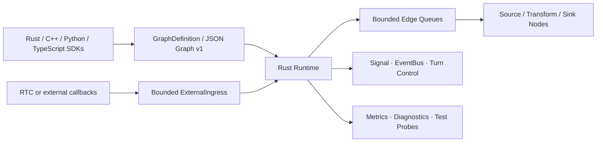

# Voxa

> A Rust-native, real-time multimodal agent runtime with one graph and lifecycle contract across Rust, C++, Python, and TypeScript.

[简体中文](README.zh-CN.md) · [Architecture](docs/design/01-product-and-technical-contract.md) · [Graph v1](docs/graph-v1-reference.md) · [Testing](docs/testing/README.md)


Voxa is an early-stage runtime for building streaming voice, video, text, and binary agents as static processing graphs. Rust owns scheduling, bounded queues, backpressure, lifecycle, cancellation, signals, events, shutdown, and observability. Nodes and adapters can be implemented in Rust, C++, Python, or TypeScript without moving language-specific objects across runtime boundaries.

The project currently provides a tested foundation and mock integrations. It is not yet a production-ready agent platform.

## Why Voxa

- **One runtime core:** scheduling and safety semantics live in Rust.
- **One data model:** immutable `Frame` values carry audio, video, text, bytes, signals, and events.
- **Bounded by design:** queues, media duration, bytes, in-flight work, and shutdown deadlines have explicit limits.
- **Language isolation:** C ABI handles, Python execution domains, and Node.js workers prevent foreign code from running on RTC or Rust scheduling threads.
- **Deterministic lifecycle:** prepare, process, finish, abort, cancellation, and late-result behavior are explicit and tested.
- **One graph protocol:** programmatic builders, JSON Graph v1, the CLI, and the local Studio share the same graph definition.

## Project status

Voxa is **pre-alpha**. Stages 1–11 of the foundation plan are implemented, but several public APIs and integrations remain intentionally limited.

| Area | Status | Current boundary |
| --- | --- | --- |
| Frames, graph model, sync/concurrent runtime | Available | Static DAGs; exact port and frame types |
| Backpressure and real-time flow control | Available | Bounded queues, audio merge, managed streams |
| Signal, EventBus, turn control | Available | Adjacent signals and isolated global events |
| C ABI and C++ SDK | Available | Versioned ABI, copy-owned frames, RAII wrappers |
| Mock RTC adapter | Available | Deterministic faults and callback-safe shutdown; no real RTC SDK |
| Python/PyO3 package | Experimental | Dedicated thread and asyncio loop; `isolated_process` is rejected |
| Node-API package | Experimental | Dedicated Worker; Promise-returning transforms are rejected |
| JSON Graph v1 and CLI | Experimental | Parse, validate, initialize, and local Studio; runtime factories are limited |
| Local Studio | Foundation | Token-authenticated local HTTP/schema view; full visual canvas is planned |
| Real RTC, FFmpeg, model providers | Planned | Not included in Core or the current build |

## Architecture



The runtime never treats ASR, LLM, TTS, transport, or codec behavior as Core responsibilities. Those capabilities belong in nodes and adapters.

## Quick start

### Prerequisites

- Rust stable, as pinned by [`rust-toolchain.toml`](rust-toolchain.toml)
- A C11/C++17 compiler for the native SDK checks
- Optional: CPython 3.13 with maturin for Python bindings
- Optional: Node.js 22 and pnpm for Node-API bindings

### Build and run the Rust example

```bash
git clone https://github.com/<owner>/voxa.git
cd voxa
cargo build --workspace
cargo run -p voxa-examples --bin text_graph
```

Replace `<owner>` after the public GitHub repository is created.

### Validate a graph

```bash
cargo run -p voxa-cli -- validate examples/graphs/text-uppercase.v1.json
cargo run -p voxa-cli -- run examples/graphs/text-uppercase.v1.json
```

`voxa run` currently validates the graph and reports the compiled-in runtime-factory boundary. It does not yet execute arbitrary registered JSON nodes.

### Start the local Studio foundation

```bash
cargo run -p voxa-cli -- studio examples/graphs/text-uppercase.v1.json --no-open
```

Studio listens on `127.0.0.1` by default and generates a local access token. Binding a non-loopback address requires an explicit `--host` and prints a security warning.

### Build the language bindings

```bash
./scripts/check-python.sh
./scripts/check-node.sh
```

These scripts build real importable packages and run their integration tests. They require the corresponding local toolchains and dependency caches.

## Graph v1 example

```json
{
  "version": "voxa.graph/v1",
  "graph_id": "text-uppercase",
  "nodes": [
    {
      "id": "source",
      "node_type": "builtin.text_source",
      "language": "rust",
      "node_config": { "text": "hello" }
    },
    {
      "id": "upper",
      "node_type": "builtin.uppercase",
      "language": "rust",
      "node_config": {}
    }
  ],
  "edges": [
    {
      "id": "source-upper",
      "from": { "node_id": "source", "port": "text_out" },
      "to": { "node_id": "upper", "port": "text_in" },
      "frame_type": "text",
      "queue_policy": { "capacity": 32, "overflow": "block" }
    }
  ]
}
```

Graph JSON is declarative configuration. It cannot contain executable code, dynamic scripts, credentials, or arbitrary remote resources. See the [Graph v1 reference](docs/graph-v1-reference.md).

## Repository layout

```text
voxa/
├── crates/
│   ├── voxa-types/       # Immutable frames, IDs, values, errors
│   ├── voxa-core/        # Graph, runtime, queues, flow and control plane
│   ├── voxa-ffi/         # Versioned C ABI
│   ├── voxa-graph-json/  # Graph v1 parser and compiler
│   ├── voxa-cli/         # voxa command-line interface
│   ├── voxa-studio/      # Local token-authenticated Studio server
│   ├── voxa-python/      # PyO3/maturin package
│   ├── voxa-node/        # Node-API native module
│   └── voxa-testkit/     # Deterministic test harnesses
├── bindings/node/        # @voxa/core package
├── cpp/                  # Public C/C++ headers, examples, Mock RTC
├── examples/graphs/      # Graph v1 examples
├── fuzz/                 # Fuzz targets
├── docs/                 # Design, testing and pre-release reports
└── scripts/              # Reproducible quality gates
```

## Quality gates

Run the consolidated local gate:

```bash
./scripts/check-quality.sh
```

Individual gates include:

```bash
./scripts/check-rust.sh
./scripts/check-ffi.sh
./scripts/check-ffi-asan.sh
./scripts/check-rtc.sh
./scripts/check-rtc-asan.sh
./scripts/check-python.sh
./scripts/check-node.sh
./scripts/check-bench.sh
```

The test framework covers deterministic graph faults, queue pressure, managed-stream cancellation, foreign execution domains, ABI ownership, Mock RTC shutdown, CLI/Studio authorization, and port conflicts. Optional Miri, fuzz, and TSan scripts report an explicit `SKIP` when the required toolchain is unavailable.

## Roadmap

Near-term priorities:

1. Stabilize public Rust, C++, Python, and TypeScript SDK contracts.
2. Connect registered Graph v1 node factories to general runtime execution.
3. Complete the visual Studio graph editor and live metrics views.
4. Add a production-reviewed RTC adapter and media/codec integration.
5. Implement versioned Python process isolation and TypeScript Promise support.
6. Publish packages, compatibility matrices, performance baselines, and release artifacts.

Real provider integrations should remain adapters or nodes and must not become mandatory Core dependencies.

## Contributing

Design feedback, bug reports, reproducible test cases, and focused pull requests are welcome. Before changing runtime contracts, read the [product and technical contract](docs/design/01-product-and-technical-contract.md) and the [testing guide](docs/testing/README.md).

Please keep changes bounded, deterministic, and free of real service credentials. New foreign-language, RTC, or network integrations must include ownership, threading, cancellation, late-callback, and shutdown tests.

Dedicated `CONTRIBUTING.md`, Code of Conduct, issue templates, and pull-request templates are planned before the first public release.

## Security

Voxa is pre-alpha and must not be used to execute untrusted code or expose Studio directly to the public internet. Graph files must never contain secrets. Use local credential references and keep Studio on its default loopback address.

GitHub private vulnerability reporting and a dedicated `SECURITY.md` should be enabled before public deployment.

## License

**A project license has not been selected yet.** Until a `LICENSE` file is added, the source is not licensed for copying, modification, or redistribution. The maintainer should explicitly choose a license—commonly Apache-2.0, MIT, or a deliberate dual license—before announcing Voxa as an open-source release.
