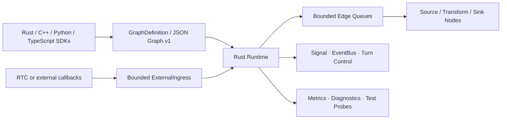

# Voxa

> A Rust-native, real-time multimodal agent runtime with one graph and lifecycle contract across Rust, C++, Python, and TypeScript.

[简体中文](README.zh-CN.md) · [Documentation](https://piyotahu.github.io/Voxa/) · [Install](https://piyotahu.github.io/Voxa/getting-started/) · [Build Nodes](https://piyotahu.github.io/Voxa/nodes/) · [Studio](https://piyotahu.github.io/Voxa/studio/) · [Graph v1](https://piyotahu.github.io/Voxa/graph/) · [Testing](https://piyotahu.github.io/Voxa/testing/)


[](https://github.com/PiyotaHu/Voxa/actions/workflows/ci.yml)
[](https://github.com/PiyotaHu/Voxa/actions/workflows/bindings.yml)
[](https://piyotahu.github.io/Voxa/)


Voxa is an early-stage runtime for building streaming voice, video, text, and binary agents as static processing graphs. Rust owns scheduling, bounded queues, backpressure, lifecycle, cancellation, signals, events, shutdown, and observability. Nodes and adapters can be implemented in Rust, C++, Python, or TypeScript without moving language-specific objects across runtime boundaries.

The project currently provides a tested foundation and mock integrations. It is not yet a production-ready agent platform.

## Why Voxa

- **One runtime core:** scheduling and safety semantics live in Rust.
- **One data model:** immutable `Frame` values carry audio, video, text, bytes, signals, and events.
- **Bounded by design:** queues, media duration, bytes, in-flight work, and shutdown deadlines have explicit limits.
- **Language isolation:** C ABI handles, Python execution domains, and Node.js workers prevent foreign code from running on RTC or Rust scheduling threads.
- **Deterministic lifecycle:** prepare, process, finish, abort, cancellation, and late-result behavior are explicit and tested.
- **One graph protocol:** programmatic builders, JSON Graph v1, the CLI, and the local Studio share the same graph definition.

## Project status

Voxa is **pre-alpha**. Stages 1–11 of the foundation plan are implemented, but several public APIs and integrations remain intentionally limited.

| Area | Status | Current boundary |
| --- | --- | --- |
| Frames, graph model, sync/concurrent runtime | Available | Static DAGs; exact port and frame types |
| Backpressure and real-time flow control | Available | Bounded queues, audio merge, managed streams |
| Signal, EventBus, turn control | Available | Adjacent signals and isolated global events |
| C ABI and C++ SDK | Available | Versioned ABI, RAII wrappers, installable CMake package, and hosted Graph v1 text factories |
| RTC adapters | Experimental | Mock contract plus isolated Agora C++ PCM16/I420 provider; live credential certification remains |
| Media normalization | Experimental | Optional FFmpeg streaming audio resampling plus RGBA8/I420 scale and color conversion |
| Python/PyO3 package | Experimental | Dedicated thread/asyncio loop and hosted Graph v1 text factories; `isolated_process` is rejected |
| Node-API package | Experimental | Dedicated Worker and hosted Graph v1 text factories; Promise-returning transforms are rejected |
| JSON Graph v1 and CLI | Experimental | Exact-version Registry compilation, concurrent execution of compiled-in factories, bounded waits, initialization, and local Studio |
| Local Studio | Available | Node Lab, typed wiring, Python Host, C++ ABI packs, project experiences, local Run/Stop |
| Model providers | Experimental | Application-owned Qwen Python packs; never linked into Core |

## Architecture



The runtime never treats ASR, LLM, TTS, transport, or codec behavior as Core responsibilities. Those capabilities belong in nodes and adapters.

## Quick start

### Prerequisites

- Rust stable, as pinned by [`rust-toolchain.toml`](rust-toolchain.toml)
- A C11/C++17 compiler and CMake 3.20+ for the native SDK checks
- Optional: CPython 3.13 with maturin for Python bindings
- Optional: Node.js 22 and pnpm for Node-API bindings

### Install the `voxa` CLI once

```bash
git clone https://github.com/PiyotaHu/Voxa.git voxa
cd voxa
cargo install --locked --path crates/voxa-cli
voxa --version
```

Until the first binary release, installation builds the CLI from the checkout.
After that one-time step, normal usage never needs `cargo run -p ...` or
knowledge of the Rust workspace.

### Run a self-contained demo

```bash
voxa demo
```

The default demo executes a four-turn, eight-node voice-agent session with two
real fan-outs and a stateful join. Typed PCM frames flow concurrently through mock
streaming ASR and voice-activity detection, merge into LLM context, then fan
out to a live transcript and mock neural TTS. Providers are clearly labeled
`mock`; graph compilation, immutable Frames, bounded queues, concurrent
scheduling, scheduled source ticks, fork/join routing, EventBus publish/subscribe,
Signals, and lifecycle execution are real Voxa Runtime.

```text
microphone(audio)
  ├─> streaming-asr(text) ─────┐
  └─> voice-activity(event) ───┴─> context-fusion -> reasoning-llm
                                                       ├─> live-transcript
                                                       └─> neural-tts(audio) -> speaker
```

For the intentionally small installation smoke test, run
`voxa demo --scenario text`.

Keep the mock session alive for a longer architecture review with
`voxa demo --turns 20 --interval-ms 1000`.

### Run the credentialed flagship voice room

The flagship application offers both Qwen Audio Realtime and an inspectable
VAD → ASR → LLM → TTS graph, with Agora C++ transport and a browser microphone:

```bash
./examples/voice-agent/setup.sh /absolute/path/to/agora-native-sdk
./examples/voice-agent/run.sh
```

Choose a graph in Studio, fill **Connections**, then open **Voice Room**. The
full setup, three-identity RTC token model, security boundary, and offline gates
are documented in [the flagship application guide](examples/voice-agent/README.md).

### Create, validate, and run a graph

```bash
voxa init my-agent.voxa.json
voxa validate my-agent.voxa.json
voxa run my-agent.voxa.json
```

`voxa validate` is side-effect free: it never creates or starts a Node. `voxa run`
compiles the graph against the built-in Registry, materializes every exact
Factory selection, and executes it through the concurrent Runtime. Runs have a
30-second default deadline; use `--timeout-ms` and `--shutdown-timeout-ms` to
set bounded execution and cleanup waits.

### Start the local visual Studio

```bash
voxa studio my-agent.voxa.json
```

Studio opens a bundled visual Graph v1 editor. Drag Nodes from the Palette,
wire compatible typed ports, inspect live runtime metrics, or open **Create
Node** to edit and register a project Node without leaving the browser. Text
Python project Nodes run through the trusted local development Host. Studio
listens on `127.0.0.1` by default and generates a local access token. See the
[Studio guide](https://piyotahu.github.io/Voxa/studio/).

### Build and test the language SDKs

```bash
./scripts/check-python.sh
./scripts/check-node.sh
./scripts/check-ffi.sh
```

These scripts build real installable packages, run integration tests, and execute independent Python, TypeScript, and C++ consumer examples. See the [Node development guide](https://piyotahu.github.io/Voxa/nodes/) for language-specific workflows.

## Graph v1 example

The complete executable voice graph is
[`examples/graphs/mock-realtime-voice.v1.json`](examples/graphs/mock-realtime-voice.v1.json).
Run it directly with `voxa run examples/graphs/mock-realtime-voice.v1.json`, or
open it visually with `voxa studio examples/graphs/mock-realtime-voice.v1.json`.

Graph JSON is declarative configuration. It cannot contain executable code, dynamic scripts, credentials, or arbitrary remote resources. See the [Graph and typed ports guide](https://piyotahu.github.io/Voxa/graph/).

## Repository layout

```text
voxa/
├── crates/
│   ├── voxa-types/       # Immutable frames, IDs, values, errors
│   ├── voxa-core/        # Graph, runtime, queues, flow and control plane
│   ├── voxa-ffi/         # Versioned C ABI
│   ├── voxa-graph-json/  # Graph v1 parser and compiler
│   ├── voxa-cli/         # voxa command-line interface
│   ├── voxa-studio/      # Local token-authenticated Studio server
│   ├── voxa-python/      # PyO3/maturin package
│   ├── voxa-node/        # Node-API native module
│   └── voxa-testkit/     # Deterministic test harnesses
├── bindings/node/        # @voxa/core package
├── cpp/                  # Public C/C++ SDK, RTC adapters and media providers
├── examples/             # Rust, graph, Python, TypeScript and C++ examples
├── fuzz/                 # Fuzz targets
├── docs/                 # Design, testing and pre-release reports
└── scripts/              # Reproducible quality gates
```

## Quality gates

The commands below are for Voxa contributors working on the repository, not
for application developers using the installed `voxa` binary.

Run the consolidated local gate:

```bash
./scripts/check-quality.sh
```

Individual gates include:

```bash
./scripts/check-rust.sh
./scripts/check-ffi.sh
./scripts/check-ffi-asan.sh
./scripts/check-rtc.sh
./scripts/check-rtc-asan.sh
./scripts/check-python.sh
./scripts/check-node.sh
./scripts/check-cpp-consumer.sh
./scripts/check-bench.sh
```

The test framework covers deterministic graph faults, queue pressure, managed-stream cancellation, foreign execution domains, ABI ownership, Mock RTC shutdown, CLI/Studio authorization, and port conflicts. Optional Miri, fuzz, and TSan scripts report an explicit `SKIP` when the required toolchain is unavailable.

## Roadmap

Near-term priorities:

1. Stabilize public Rust, C++, Python, and TypeScript SDK contracts.
2. Stabilize the new schema-driven multimodal Source, Transform, Sink, and named multi-output foreign Factory APIs.
3. Stabilize Studio live runtime metrics and execution-control contracts.
4. Run and retain D09 Agora live-room certification on each release platform; extend D08 into compressed codec/device providers.
5. Implement versioned Python process isolation and TypeScript Promise support.
6. Publish packages, compatibility matrices, performance baselines, and release artifacts.

Real provider integrations should remain adapters or nodes and must not become mandatory Core dependencies.

## Contributing

Design feedback, bug reports, reproducible test cases, and focused pull requests
are welcome. Read [CONTRIBUTING.md](CONTRIBUTING.md), the
[Code of Conduct](CODE_OF_CONDUCT.md), and the
[governance model](GOVERNANCE.md) before participating. Public API, Graph or
Manifest Schema, Runtime, Studio, CLI, provider, and architecture changes must
update `docs/` in the same pull request.

Please keep changes bounded, deterministic, and free of real service credentials. New foreign-language, RTC, or network integrations must include ownership, threading, cancellation, late-callback, and shutdown tests.

## Security

Voxa is pre-alpha and must not be used to execute untrusted code or expose
Studio directly to the public internet. Graph files must never contain secrets.
Report vulnerabilities privately according to [SECURITY.md](SECURITY.md).

See [CHANGELOG.md](CHANGELOG.md) for notable unreleased changes and
[SUPPORT.md](SUPPORT.md) for help channels and report requirements.

## License

Voxa is licensed under the [Apache License 2.0](LICENSE).
