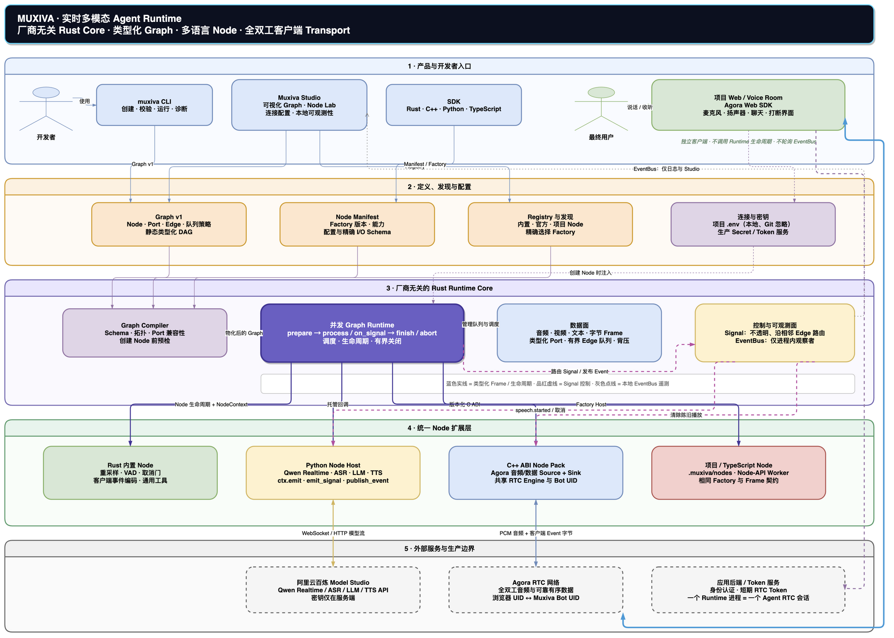

# Muxiva

> 一个以 Rust 为核心的实时多模态 Agent Runtime，让 Rust、C++、Python 与 TypeScript 共享同一套图、生命周期和安全边界。

[English](README.md) · [中文文档](https://piyotahu.github.io/muxiva/zh/) · [系统架构](https://piyotahu.github.io/muxiva/zh/concepts/) · [旗舰语音 Demo](https://piyotahu.github.io/muxiva/zh/voice-demo/) · [开发 Node](https://piyotahu.github.io/muxiva/zh/nodes/) · [Studio](https://piyotahu.github.io/muxiva/zh/studio/) · [Graph v1](https://piyotahu.github.io/muxiva/zh/graph/) · [测试体系](https://piyotahu.github.io/muxiva/zh/testing/)


[](https://github.com/PiyotaHu/muxiva/actions/workflows/ci.yml)
[](https://github.com/PiyotaHu/muxiva/actions/workflows/bindings.yml)
[](https://piyotahu.github.io/muxiva/)


Muxiva 是一个早期阶段的实时多模态 Agent Runtime，用静态处理图构建语音、视频、文本和二进制流应用。Rust 统一负责调度、有界队列、背压、生命周期、取消、Signal、Event、关闭和可观测性；节点和 Adapter 可以使用 Rust、C++、Python 或 TypeScript 编写，语言对象不会跨越 Runtime 边界。

项目目前提供经过测试的基础 Runtime，以及应用层 Qwen + Agora 真实语音门面应用，
但尚未达到生产级 Agent 平台标准。

## 为什么选择 Muxiva

- **单一 Runtime Core：**调度和安全语义统一由 Rust 实现。
- **单一数据模型：**不可变 `Frame` 承载音频、视频、文本、字节、Signal 和 Event。
- **默认有界：**队列、媒体时长、字节数、在途任务和关闭期限都有明确上限。
- **语言执行隔离：**C ABI Handle、Python 执行域和 Node.js Worker 避免外语代码运行在 RTC 回调或 Rust 调度线程。
- **确定性生命周期：**prepare、process、finish、abort、取消和晚到结果都有明确且可测试的行为。
- **统一图协议：**代码 GraphBuilder、JSON Graph v1、CLI 和本地 Studio 使用同一种图定义。

## 项目状态

Muxiva 当前为 **pre-alpha**。0 到 1 计划的 Stage 1–11 已完成，但部分公开 API 与集成仍有意保持受限。

| 领域 | 状态 | 当前边界 |
| --- | --- | --- |
| Frame、图模型、同步/并发 Runtime | 可用 | 静态 DAG，端口与 Frame 类型精确匹配 |
| 背压与实时流控 | 可用 | 有界队列、音频合帧、Managed Stream |
| Signal 与 EventBus 控制 | 可用 | Signal 沿显式相邻 Edge 路由；Event 仅进程内可观察 |
| C ABI 与 C++ SDK | 可用 | 版本化 ABI、RAII Wrapper、可安装 CMake 包与宿主注册的 Graph v1 文本 Factory |
| RTC Node | 实验性 | 共享 Session 的 Agora C++ 音频/数据输入输出；尚需带凭证实房认证 |
| 媒体归一化 | 实验性 | 可选 FFmpeg 流式音频重采样，以及 RGBA8/I420 缩放和色彩转换 |
| Python/PyO3 包 | 实验性 | 独立线程/asyncio loop 与宿主 Graph v1 文本 Factory；明确拒绝 `isolated_process` |
| Node-API 包 | 实验性 | 独立 Worker 与宿主 Graph v1 文本 Factory；明确拒绝返回 Promise 的 Transform |
| JSON Graph v1 与 CLI | 实验性 | 精确版本 Registry 编译、内置 Factory 并发执行、有界等待、初始化和本地 Studio |
| 本地 Studio | 可用 | Node Lab、类型化连线、Python Host、C++ ABI Pack、项目体验与本地 Run/Stop |
| 模型 Node | 实验性 | Qwen Python Node Pack 是 Core 外部的厂商适配 Node |

## 架构

[](https://piyotahu.github.io/muxiva/zh/concepts/)

这张图从上到下描述完整系统：产品入口声明 Graph 并发现 Node Factory；厂商无关的
Rust Core 编译和执行 Graph；Rust、C++、Python 与 TypeScript Node 提供可替换能力；
RTC、模型 API 与 Token 服务留在 Core 之外。蓝色实线表示数据或调用，品红虚线表示
Signal 控制，灰色点线表示进程内 EventBus 可观测信息。

ASR、LLM、TTS、Transport、Codec 和厂商“Provider”都不是 Runtime Core 的职责。
请继续阅读[系统全景与核心概念串讲](https://piyotahu.github.io/muxiva/zh/concepts/)，
或打开[可编辑 Draw.io 源文件](docs/site/zh/assets/architecture/muxiva-system-overview.drawio)。

## 快速开始

### 环境要求

- [`rust-toolchain.toml`](rust-toolchain.toml) 固定的 Rust stable 工具链
- 执行 Native SDK 检查所需的 C11/C++17 编译器与 CMake 3.20+
- 可选：CPython 3.13 与 maturin，用于 Python Binding
- 可选：Node.js 22 与 pnpm，用于 Node-API Binding

### 一次安装 `muxiva` CLI

```bash
git clone https://github.com/PiyotaHu/muxiva.git muxiva
cd muxiva
cargo install --locked --path crates/muxiva-cli
muxiva --version
```

首次二进制 Release 发布前，安装过程会从源码构建 CLI。完成这一次安装后，
日常使用不再需要 `cargo run -p ...`，也不需要理解 Rust workspace。

### 运行真实语音助手

门面应用同时提供 Qwen Audio Realtime 与 **Demo 2**：可检查的全双工阿里云 Server
VAD + ASR → 可取消 Qwen LLM → 可取消 Qwen TTS 图，使用 Agora C++ Transport 和
浏览器麦克风：

```bash
./examples/voice-agent/setup.sh       # macOS：自动下载并校验 Agora SDK
./examples/voice-agent/run.sh
```

在 Studio 选择图、填写 **Connections**、点击 **Run**，然后打开 **Voice Room**。完整安装流程、
双身份共享 RTC Session 模型、安全边界和离线门禁见
[旗舰语音 Demo 指南](https://piyotahu.github.io/muxiva/zh/voice-demo/)。

### 创建、校验并运行 Graph

```bash
muxiva init my-agent
muxiva validate my-agent
muxiva run my-agent
```

`muxiva init` 会创建完整项目目录。`muxiva validate` 是无副作用的，不会创建或启动 Node。`muxiva run` 会使用内置
Registry 编译 Graph，实例化每个精确版本的 Factory，并通过并发 Runtime
真正执行。默认执行期限为 30 秒；可用 `--timeout-ms` 和
`--shutdown-timeout-ms` 设置有界的执行与清理等待时间。

### 启动本地可视化 Studio

```bash
muxiva studio
```

无参数时会自动发现当前项目；在 Muxiva 仓库根目录会直接打开旗舰 Voice Agent。
Studio 会打开内置 Graph v1 可视化编辑器。开发者可以把 Node 从 Palette
拖进画布，在类型兼容的端口之间直接拉线，也可以点击 **Create Node**，在网页里
编辑代码、声明端口并保存注册到项目 Node Library。当前文本 Python Node 可由
可信本地开发 Host 直接运行。Studio 默认只监听 `127.0.0.1` 并生成本地访问
Token。详见 [Studio 指南](https://piyotahu.github.io/muxiva/zh/studio/)。

### 构建并测试多语言 SDK

```bash
./scripts/check-python.sh
./scripts/check-node.sh
./scripts/check-ffi.sh
```

脚本会构建可真实安装的包、执行集成测试，并运行独立的 Python、TypeScript 与 C++ 消费者示例。安装与 Node 开发方式参见[Node 开发指南](https://piyotahu.github.io/muxiva/zh/nodes/)。

## 旗舰 Graph

真实语音应用的 Realtime 与 Cascade 模板位于
[`examples/voice-agent/.muxiva/templates/`](examples/voice-agent/.muxiva/templates/)。
通过 `./examples/voice-agent/run.sh` 启动 Studio 后，可以直接选择、查看和编辑两张图。

Graph JSON 只用于声明式配置，不能包含可执行代码、动态脚本、凭据或任意远程资源。详见 [Graph 与类型化端口](https://piyotahu.github.io/muxiva/zh/graph/)。

## 仓库结构

```text
muxiva/
├── crates/
│   ├── muxiva-types/       # 不可变 Frame、ID、Value、Error
│   ├── muxiva-core/        # Graph、Runtime、Queue、Flow、Control Plane
│   ├── muxiva-ffi/         # 版本化 C ABI
│   ├── muxiva-graph-json/  # Graph v1 Parser 与 Compiler
│   ├── muxiva-cli/         # muxiva 命令行
│   ├── muxiva-studio/      # Token 鉴权的本地 Studio Server
│   ├── muxiva-python/      # PyO3/maturin 包
│   ├── muxiva-node/        # Node-API Native Module
│   └── muxiva-testkit/     # 确定性测试 Harness
├── bindings/node/        # @muxiva/core 包
├── cpp/                  # 公共 C/C++ SDK
├── providers/            # 厂商集成：Qwen/Python 与 Agora/C++
├── examples/             # Rust、Graph、Python、TypeScript 与 C++ 示例
├── fuzz/                 # Fuzz Target
├── docs/                 # 设计、测试与预发布报告
└── scripts/              # 可复现质量门禁
```

## 质量门禁

下面的命令供修改 Muxiva 仓库本身的贡献者使用，不是安装 `muxiva` 二进制后的
应用开发方式。

执行统一的本地检查：

```bash
./scripts/check-quality.sh
```

独立检查包括：

```bash
./scripts/check-rust.sh
./scripts/check-ffi.sh
./scripts/check-ffi-asan.sh
./scripts/check-rtc.sh
./scripts/check-rtc-asan.sh
./scripts/check-python.sh
./scripts/check-node.sh
./scripts/check-cpp-consumer.sh
./scripts/check-bench.sh
```

测试体系覆盖 Graph 故障、队列压力、Managed Stream 取消、外语执行域、ABI 所有权、Mock RTC 关闭、CLI/Studio 鉴权与端口冲突。缺少对应工具链时，Miri、fuzz 和 TSan 脚本会明确报告 `SKIP`，不会伪装成通过。

## 路线图

近期优先级：

1. 稳定 Rust、C++、Python 和 TypeScript 公开 SDK 契约。
2. 将外语 Graph Factory 从空配置文本 Transform 扩展到 Schema 驱动的多模态 Source、Transform 与 Sink。
3. 为可视化 Studio 增加实时 Runtime 指标和执行控制。
4. 在每个发布平台执行并留存 D09 Agora 实房长稳认证，并将 D08 扩展到压缩 Codec 与设备 Provider。
5. 实现版本化 Python 进程隔离与 TypeScript Promise 支持。
6. 发布多语言包、兼容矩阵、性能基线和 Release Artifact。

真实 Provider 集成应保持为 Adapter 或 Node，不能成为 Core 的强制依赖。

## 参与贡献

欢迎提交设计反馈、Bug、可复现测试用例和范围清晰的 Pull Request。参与前请阅读
[贡献指南](CONTRIBUTING.md)、[行为准则](CODE_OF_CONDUCT.md)和
[治理方式](GOVERNANCE.md)。公开 API、Graph/Manifest Schema、Runtime、
Studio、CLI、Provider 或架构变化必须在同一个 PR 更新 `docs/`。

变更应保持有界、确定性，并且不能包含真实服务凭据。新增外语、RTC 或网络集成时，必须包含所有权、线程、取消、晚到回调和关闭测试。

## 安全

Muxiva 仍处于 pre-alpha 阶段，不能用于执行不可信代码，也不应将 Studio 直接
暴露到公网。Graph 文件不得包含密钥；漏洞请按照[安全策略](SECURITY.md)私密报告。

重要变化记录在 [CHANGELOG.md](CHANGELOG.md)，支持渠道参见
[SUPPORT.md](SUPPORT.md)。

## 许可证

Muxiva 使用 [Apache License 2.0](LICENSE) 开源。
