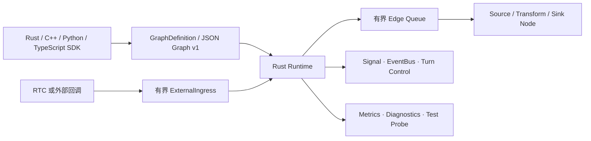

# Voxa

> 一个以 Rust 为核心的实时多模态 Agent Runtime，让 Rust、C++、Python 与 TypeScript 共享同一套图、生命周期和安全边界。

[English](README.md) · [架构设计](docs/design/01-product-and-technical-contract.md) · [多语言 SDK](docs/sdk/README.md) · [Studio](docs/studio.md) · [Graph v1](docs/graph-v1-reference.md) · [测试体系](docs/testing/README.md)


Voxa 是一个早期阶段的实时多模态 Agent Runtime，用静态处理图构建语音、视频、文本和二进制流应用。Rust 统一负责调度、有界队列、背压、生命周期、取消、Signal、Event、关闭和可观测性；节点和 Adapter 可以使用 Rust、C++、Python 或 TypeScript 编写，语言对象不会跨越 Runtime 边界。

项目目前提供经过测试的基础 Runtime 与 Mock 集成，但尚未达到生产级 Agent 平台标准。

## 为什么选择 Voxa

- **单一 Runtime Core：**调度和安全语义统一由 Rust 实现。
- **单一数据模型：**不可变 `Frame` 承载音频、视频、文本、字节、Signal 和 Event。
- **默认有界：**队列、媒体时长、字节数、在途任务和关闭期限都有明确上限。
- **语言执行隔离：**C ABI Handle、Python 执行域和 Node.js Worker 避免外语代码运行在 RTC 回调或 Rust 调度线程。
- **确定性生命周期：**prepare、process、finish、abort、取消和晚到结果都有明确且可测试的行为。
- **统一图协议：**代码 GraphBuilder、JSON Graph v1、CLI 和本地 Studio 使用同一种图定义。

## 项目状态

Voxa 当前为 **pre-alpha**。0 到 1 计划的 Stage 1–11 已完成，但部分公开 API 与集成仍有意保持受限。

| 领域 | 状态 | 当前边界 |
| --- | --- | --- |
| Frame、图模型、同步/并发 Runtime | 可用 | 静态 DAG，端口与 Frame 类型精确匹配 |
| 背压与实时流控 | 可用 | 有界队列、音频合帧、Managed Stream |
| Signal、EventBus、turn 控制 | 可用 | 相邻 Signal 与隔离的全局 Event |
| C ABI 与 C++ SDK | 可用 | 版本化 ABI、RAII Wrapper、可安装 CMake 包；当前为单 Node 文本 Runner |
| Mock RTC Adapter | 可用 | 确定性故障和回调安全关闭；不含真实 RTC SDK |
| Python/PyO3 包 | 实验性 | 独立线程和 asyncio loop；明确拒绝 `isolated_process` |
| Node-API 包 | 实验性 | 独立 Worker；明确拒绝返回 Promise 的 Transform |
| JSON Graph v1 与 CLI | 实验性 | 解析、校验、初始化和本地 Studio；Runtime Factory 仍受限 |
| 本地 Studio | 可用 | 内置可视化画布、Node/Edge 编辑、校验与原子保存 |
| 真实 RTC、FFmpeg、模型 Provider | 规划中 | 当前不属于 Core，也不是构建依赖 |

## 架构



ASR、LLM、TTS、Transport 和 Codec 不属于 Runtime Core，它们应该作为 Node 或 Adapter 接入。

## 快速开始

### 环境要求

- [`rust-toolchain.toml`](rust-toolchain.toml) 固定的 Rust stable 工具链
- 执行 Native SDK 检查所需的 C11/C++17 编译器与 CMake 3.20+
- 可选：CPython 3.13 与 maturin，用于 Python Binding
- 可选：Node.js 22 与 pnpm，用于 Node-API Binding

### 构建并运行 Rust 示例

```bash
git clone https://github.com/PiyotaHu/Voxa.git
cd voxa
cargo build --workspace
cargo run -p voxa-examples --bin text_graph
```

### 校验 Graph

```bash
cargo run -p voxa-cli -- validate examples/graphs/text-uppercase.v1.json
cargo run -p voxa-cli -- run examples/graphs/text-uppercase.v1.json
```

当前 `voxa run` 会校验图并报告内置 Runtime Factory 的能力边界，尚不能执行任意注册的 JSON Node。

### 启动本地可视化 Studio

```bash
cargo run -p voxa-cli -- studio examples/graphs/text-uppercase.v1.json
```

Studio 会打开内置的 Graph v1 可视化编辑器，提供 Node Palette、SVG 画布、Inspector、Edge 编辑、诊断、JSON 源码、Undo/Redo 和原子保存。它默认只监听 `127.0.0.1`，并生成本地访问 Token。监听非 loopback 地址时必须显式设置 `--host`，终端会输出安全警告。详见 [Studio 指南](docs/studio.md)。

### 构建并测试多语言 SDK

```bash
./scripts/check-python.sh
./scripts/check-node.sh
./scripts/check-ffi.sh
```

脚本会构建可真实安装的包、执行集成测试，并运行独立的 Python、TypeScript 与 C++ 消费者示例。安装与 Node 开发方式参见[多语言 SDK 指南](docs/sdk/README.md)。

## Graph v1 示例

```json
{
  "version": "voxa.graph/v1",
  "graph_id": "text-uppercase",
  "nodes": [
    {
      "id": "source",
      "node_type": "builtin.text_source",
      "language": "rust",
      "node_config": { "text": "hello" }
    },
    {
      "id": "upper",
      "node_type": "builtin.uppercase",
      "language": "rust",
      "node_config": {}
    }
  ],
  "edges": [
    {
      "id": "source-upper",
      "from": { "node_id": "source", "port": "text_out" },
      "to": { "node_id": "upper", "port": "text_in" },
      "frame_type": "text",
      "queue_policy": { "capacity": 32, "overflow": "block" }
    }
  ]
}
```

Graph JSON 只用于声明式配置，不能包含可执行代码、动态脚本、凭据或任意远程资源。详见 [Graph v1 参考](docs/graph-v1-reference.md)。

## 仓库结构

```text
voxa/
├── crates/
│   ├── voxa-types/       # 不可变 Frame、ID、Value、Error
│   ├── voxa-core/        # Graph、Runtime、Queue、Flow、Control Plane
│   ├── voxa-ffi/         # 版本化 C ABI
│   ├── voxa-graph-json/  # Graph v1 Parser 与 Compiler
│   ├── voxa-cli/         # voxa 命令行
│   ├── voxa-studio/      # Token 鉴权的本地 Studio Server
│   ├── voxa-python/      # PyO3/maturin 包
│   ├── voxa-node/        # Node-API Native Module
│   └── voxa-testkit/     # 确定性测试 Harness
├── bindings/node/        # @voxa/core 包
├── cpp/                  # C/C++ Header、示例、Mock RTC
├── examples/             # Rust、Graph、Python、TypeScript 与 C++ 示例
├── fuzz/                 # Fuzz Target
├── docs/                 # 设计、测试与预发布报告
└── scripts/              # 可复现质量门禁
```

## 质量门禁

执行统一的本地检查：

```bash
./scripts/check-quality.sh
```

独立检查包括：

```bash
./scripts/check-rust.sh
./scripts/check-ffi.sh
./scripts/check-ffi-asan.sh
./scripts/check-rtc.sh
./scripts/check-rtc-asan.sh
./scripts/check-python.sh
./scripts/check-node.sh
./scripts/check-cpp-consumer.sh
./scripts/check-bench.sh
```

测试体系覆盖 Graph 故障、队列压力、Managed Stream 取消、外语执行域、ABI 所有权、Mock RTC 关闭、CLI/Studio 鉴权与端口冲突。缺少对应工具链时，Miri、fuzz 和 TSan 脚本会明确报告 `SKIP`，不会伪装成通过。

## 路线图

近期优先级：

1. 稳定 Rust、C++、Python 和 TypeScript 公开 SDK 契约。
2. 将 Graph v1 注册的 Node Factory 接入通用 Runtime 执行。
3. 为可视化 Studio 增加实时 Runtime 指标和执行控制。
4. 接入经过生产评审的 RTC Adapter 与媒体/Codec 能力。
5. 实现版本化 Python 进程隔离与 TypeScript Promise 支持。
6. 发布多语言包、兼容矩阵、性能基线和 Release Artifact。

真实 Provider 集成应保持为 Adapter 或 Node，不能成为 Core 的强制依赖。

## 参与贡献

欢迎提交设计反馈、Bug、可复现测试用例和范围清晰的 Pull Request。修改 Runtime 契约前，请阅读[产品与技术契约](docs/design/01-product-and-technical-contract.md)和[测试指南](docs/testing/README.md)。

变更应保持有界、确定性，并且不能包含真实服务凭据。新增外语、RTC 或网络集成时，必须包含所有权、线程、取消、晚到回调和关闭测试。

独立的 `CONTRIBUTING.md`、行为准则、Issue Template 和 Pull Request Template 将在首次公开发布前补齐。

## 安全

Voxa 仍处于 pre-alpha 阶段，不能用于执行不可信代码，也不应将 Studio 直接暴露到公网。Graph 文件不得包含密钥；应使用本地凭据引用，并保持 Studio 默认监听 loopback 地址。

公开部署前应启用 GitHub Private Vulnerability Reporting，并增加独立的 `SECURITY.md`。

## 许可证

Voxa 使用 [Apache License 2.0](LICENSE) 开源。
