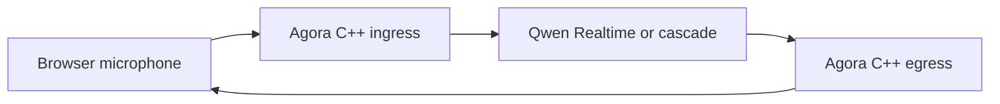

# Voxa

**One real-time multimodal graph. One lifecycle contract. Rust, C++, Python,
and TypeScript Nodes.**

Voxa is a Rust-native runtime for streaming voice, video, text, and binary
agents. It owns scheduling, bounded queues, backpressure, cancellation,
lifecycle, control messages, and observability while language SDKs provide the
Node implementations.

!!! warning "Pre-alpha"
    The foundation is tested, but APIs and provider integrations are still
    evolving. Do not run untrusted Node code or expose Studio to the internet.

## Run the real voice experience

Install the `voxa` binary once, then start the Qwen + Agora flagship Voice Room:

```bash
./examples/voice-agent/setup.sh /absolute/path/to/agora-native-sdk
./examples/voice-agent/run.sh
```



This path captures and plays real audio. The offline synthetic fixture is named
`voxa simulate` and belongs to testing, not the product quick start.

## Create a Node without leaving Studio

Open **Create Node**, choose Python, edit the starter, define typed ports, and
press **Save & Register**. Studio writes a `voxa.node/v1` package into the
project Node Library and immediately adds it to the Palette. Text Python Nodes
can run in the trusted local development Host today.

[Open the Studio guide](studio.md){ .md-button .md-button--primary }
[Build a Node](nodes/README.md){ .md-button }

## Participate

Read the [contribution and support guide](contributing.md) before proposing a
public contract or Runtime change. Security vulnerabilities must be reported
privately through GitHub, never through a public Issue.

## 中文快速说明

Voxa 是 Rust 驱动的实时多模态 Agent Runtime。产品入口是 Qwen + Agora 真实语音
房间；`voxa studio` 无参数即可发现或创建工作区。`voxa simulate` 只用于无网络
Runtime 测试，不是语音产品体验。
