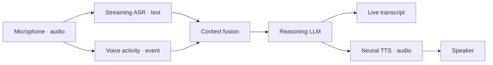

# Voxa

**One real-time multimodal graph. One lifecycle contract. Rust, C++, Python,
and TypeScript Nodes.**

Voxa is a Rust-native runtime for streaming voice, video, text, and binary
agents. It owns scheduling, bounded queues, backpressure, cancellation,
lifecycle, control messages, and observability while language SDKs provide the
Node implementations.

!!! warning "Pre-alpha"
    The foundation is tested, but APIs and provider integrations are still
    evolving. Do not run untrusted Node code or expose Studio to the internet.

## Try the technical vision

Install the `voxa` binary once, then run the branching voice-agent demo:

```bash
voxa demo
voxa studio examples/graphs/mock-realtime-voice.v1.json
```



The providers in this demo are clearly marked Mock. The graph compiler,
immutable Frames, concurrent fork/join routing, bounded queues, and lifecycle
execution are real Voxa Runtime behavior.

## Create a Node without leaving Studio

Open **Create Node**, choose Python, edit the starter, define typed ports, and
press **Save & Register**. Studio writes a `voxa.node/v1` package into the
project Node Library and immediately adds it to the Palette. Text Python Nodes
can run in the trusted local development Host today.

[Open the Studio guide](studio.md){ .md-button .md-button--primary }
[Build a Node](nodes/README.md){ .md-button }

## 中文快速说明

Voxa 是 Rust 驱动的实时多模态 Agent Runtime。推荐先运行八节点、带两处分叉
与一次汇合的语音 Agent Demo，再进入 Studio。Studio 里可以直接编写 Python
Node、声明类型化端口、保存注册，并拖到画布中连线运行。
