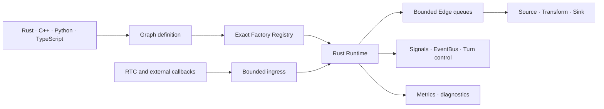

# Runtime architecture

Voxa separates deterministic runtime responsibilities from application and
provider behavior.

## Core responsibilities

- immutable typed Frames and lineage;
- exact Graph and Factory validation;
- concurrent scheduling and bounded queues;
- backpressure and overflow policy;
- prepare, process, finish, abort, and shutdown lifecycle;
- cancellation, late-result handling, and managed streams;
- Signals, global Events, and turn control;
- runtime metrics and deterministic test hooks.

## Responsibilities outside Core

ASR, LLM, TTS, RTC vendors, device access, codecs, and model APIs are Nodes or
adapters. They must not become mandatory Runtime dependencies.

## Language boundaries

Rust owns scheduling. C++ crosses a versioned C ABI, Python runs in managed
execution domains, and TypeScript runs in Node.js Workers. Foreign objects do
not move directly across Runtime boundaries; they are converted to stable Frame
representations.

## Bounded by design

Queue capacity, media duration, payload size, in-flight work, callback time,
execution deadline, and shutdown deadline require explicit limits. A real-time
system that can grow without a bound is not considered safe.
