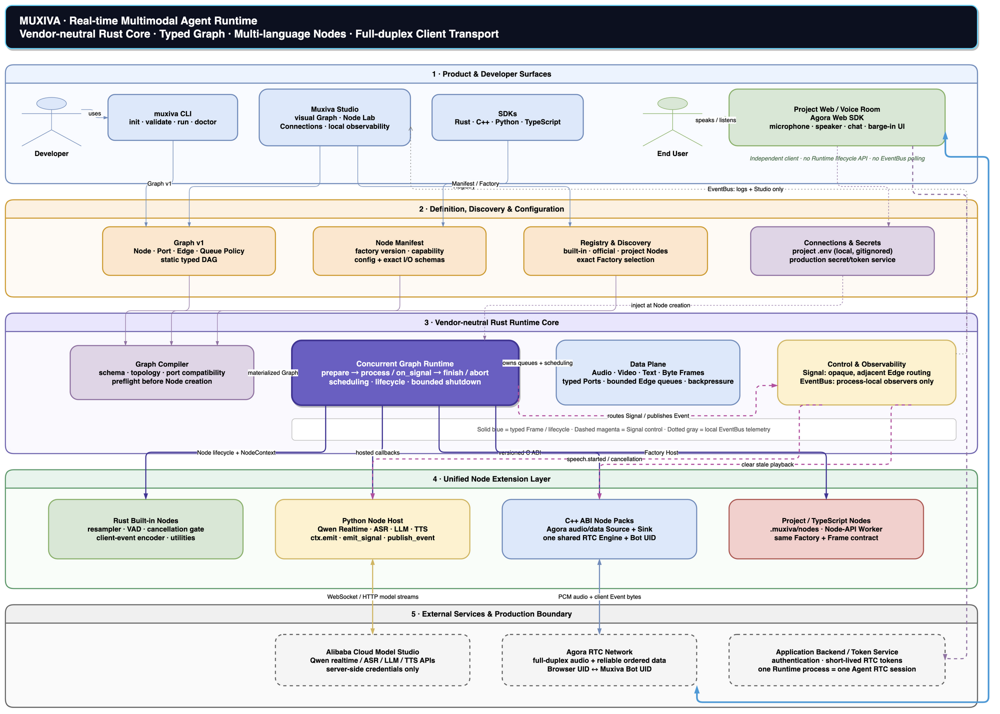

# Muxiva system overview and core concepts

Muxiva is a **real-time multimodal Agent Runtime**. A developer uses a typed Graph
to describe how audio, video, text, bytes, and control messages move. Rust Core
owns validation, scheduling, concurrency, backpressure, lifecycle, shutdown,
and observability. Replaceable Nodes provide ASR, LLM, TTS, RTC, and other
application capabilities.

The central idea is: **Core defines stable execution mechanisms, Nodes provide
replaceable capabilities, and a Graph composes both into an executable system.**

## System overview



[Download the editable Draw.io source](assets/architecture/muxiva-system-overview.drawio)

The diagram has five layers. Read the boundaries first, then the connections.
Solid blue lines represent data or calls, dashed magenta lines represent Signal
control, and dotted gray lines represent process-local NotificationBus telemetry.

### 1. Product and developer surfaces

- The **`muxiva` CLI** creates, validates, runs, and diagnoses projects for terminals,
  scripts, and CI.
- **Muxiva Studio** edits Graphs, wires Ports, displays Node source, configures local
  Connections, and observes the current Runtime.
- **Language SDKs** let Rust, C++, Python, and TypeScript developers build Graphs
  or implement Nodes.
- A **project web app / Voice Room** owns the end-user microphone, speaker, chat,
  and barge-in presentation.

The project web app is an independent client, not part of Studio. It communicates
with the Agent through RTC or an application Transport. It does not call Runtime
lifecycle APIs or poll the process-local NotificationBus.

### 2. Definition, discovery, and configuration

This layer answers three questions: **what should run, where is its implementation,
and how is it configured?**

- **Graph v1** declares Nodes, named Ports, Edges, types, queue capacities, and
  policies. It is a blueprint and contains no threads, sockets, secrets, or live
  objects.
- A **Node Manifest** declares `node_type`, language, Factory version, capabilities,
  configuration schema, and exact input/output schemas.
- **Registry and Discovery** collect built-in, official, and project Nodes and
  select the exact Factory requested by a Graph. The Runtime never guesses from
  a similar name.
- **Connections and Secrets** provide shared local connection settings to Nodes.
  Development values may live in a project `.env` ignored by Git; production
  values should come from a secret or token service.

### 3. Vendor-neutral Rust Runtime Core

This is Muxiva's stable kernel. It has no dependency on Agora, Qwen, or another
vendor.

- The **Graph Compiler** checks schemas, topology, Port direction, and compatibility
  before creating a Node, then materializes the declaration into an executable plan.
- The **Concurrent Graph Runtime** manages `prepare → process → signal → finish / abort`,
  worker scheduling, cancellation, and bounded shutdown.
- The **data plane** uses immutable Frames, typed Ports, and bounded Edge queues for
  audio, video, text, and bytes, with backpressure controlling latency and memory.
- The **control and observability plane** routes adjacent Signals and publishes Notifications
  to process-local observers. Core supplies mechanisms but does not hard-code
  interruption, turn, or vendor policy.

### 4. Unified Node extension layer

Muxiva has one executable extension concept: the **Node**. A built-in integration or
vendor adapter is a Node that follows the same contract, not another Runtime entity.

- **Rust built-in Nodes** fit resampling, VAD, cancellation gates, and general utilities.
- The **Python Node Host** fits Qwen Realtime, ASR, LLM, TTS, and fast-moving algorithms.
- **C++ ABI Node Packs** fit Agora RTC, codecs, device SDKs, and other native integrations.
- **TypeScript and project Nodes** live under an Agent project's `.muxiva/nodes/` and
  use the same Manifest, Factory, and Frame contracts.

Each language Host isolates threads, objects, and exceptions. A Graph always sees
the same Node, Port, and Frame model, regardless of implementation language.

### 5. External services and the production boundary

External models, RTC networks, and token services are not part of Core. The voice
application in the diagram uses Alibaba Cloud Model Studio and Agora as one composition;
developers can replace those Nodes without changing the Runtime. A browser receives
only short-lived RTC tokens, while model credentials remain server-side. In the current
voice deployment model, one Runtime process represents one Agent RTC session, preventing
mutable playback or generation state from leaking across sessions.

## Connect the core objects

Think of Muxiva as a controlled real-time factory:

| Concept | Plain-language model | Responsibility |
| --- | --- | --- |
| **Frame** | An item on the production line | Immutable data with an audio, video, text, or byte payload plus a traceable header |
| **Node** | A machine | Consumes Frames in lifecycle callbacks and emits zero or more outputs or control messages through `NodeContext` |
| **Port** | A typed socket | Constrains a Node's input or output by name, direction, Frame Type, and schema |
| **Edge** | A bounded conveyor | Connects one output Port to one input Port and defines capacity, backpressure, and overflow policy |
| **Graph** | The factory blueprint | Declares Nodes, Edges, configuration, and a static DAG; it stores no live state |
| **Manifest** | A machine specification | Declares Node identity, version, language, capabilities, configuration, and I/O schemas |
| **Factory** | A machine builder | Creates one independent instance for each Graph Node ID from a Manifest and configuration |
| **Registry** | The available machine catalog | Discovers Factories and selects an exact type, language, and version for a Graph |
| **Runtime** | The factory control system | Materializes, starts, schedules, limits, cancels, stops, and converges failures |
| **NodeContext** | A controlled Node console | Provides named output, Signal, Event, cancellation, and runtime context without direct downstream calls |

The relationship compresses to:

```text
Manifest + Factory → Registry → Graph Compiler → Runtime
                                           │
                     Frame → Node.output Port → bounded Edge → Node.input Port
```

## How a Graph becomes a running system

1. A developer defines Nodes and Edges through an SDK, JSON Graph v1, or Studio.
2. `muxiva validate` and the Graph Compiler check Node identity, configuration schemas,
   Ports, Frame Types, queue policies, and DAG topology without starting a Node or
   connecting to an external service.
3. The Registry selects an exact Factory for each Graph Node ID, and the Runtime
   creates independent Node instances.
4. The Runtime calls every Node's `on_prepare`, then starts Sources, workers, and
   bounded Edge queues.
5. In `on_process(frame, ctx)`, a Node calls `ctx.emit(port, frame)` for results. One
   invocation may emit nothing or emit through several named Ports.
6. Normal completion calls `on_finish`; errors, cancellation, or deadlines call
   `on_abort`, followed by bounded waits for foreign execution domains and callbacks.

## Why data, control, and observation are separate

A real-time Agent has three kinds of communication. They must not collapse into a
single universal message bus:

| Channel | Propagation | Intended content | Must not become |
| --- | --- | --- | --- |
| **Frame + Edge** | Explicit Graph topology and bounded queues | Audio, video, ASR text, LLM output, and client interaction messages | A global broadcast |
| **Signal** | Runtime delivery along the current Node's adjacent Edges | Interruption, cancellation, and stale-playback clearing that changes related Node state | Remote client transport |
| **NotificationBus notification** | Process-local observers | Logs, metrics, Studio diagnostics, transcript-ready telemetry | A browser protocol or business data path |

For barge-in, a VAD or Realtime Node detects that the user has started speaking and
emits a Signal. The Runtime delivers it to related model and playback Nodes. The model
cancels the old generation and rejects late fragments; the playback Node clears stale
audio. If a remote Voice Room must display “user is speaking,” a Transport Node sends
a client event as a Frame or byte protocol—the browser never reaches into NotificationBus.

## Current voice interruption mechanism


[Download the editable Draw.io source](assets/control/muxiva-barge-in.drawio)

The diagram follows the actual `Qwen Realtime + Agora RTC` Graph:

1. Browser microphone uplink remains active while the Agent is playing an answer, which
   provides the input side of full duplex.
2. Qwen Realtime Server VAD reports `input_audio_buffer.speech_started`. If the old
   response is active, the Qwen Node immediately sends `response.cancel` and enables its
   stale-response discard gate.
3. The Qwen Node calls `ctx.emit_signal("muxiva.voice.speech.started", ...)`. Rust Runtime
   does not interpret that name; it only follows the explicit Signal Edge and invokes
   Agora Audio Sink's `on_signal`.
4. Audio Sink clears unsent PCM, advances its cancellation sequence watermark, and drops
   old Audio Frames at or below that watermark. This is a second guard after the Qwen
   Node's late-chunk filter.
5. `speech.started` and `barge_in` also travel as client Event Frames through the Encoder
   and Agora Data Sink to the remote Voice Room. `publish_notification` only reaches the
   process-local NotificationBus for logs, metrics, and Studio diagnostics.

There is a physical boundary: audio already inside the Agora network or browser playback
buffer cannot be recalled. Low-latency interruption therefore also depends on short PCM
packets, bounded Audio Sink queues, and shallow client playback buffers. Core neither
switches application Turns nor contains Qwen- or Agora-specific interruption policy.

## Validate the model with the voice path

```text
Browser microphone
  → Agora RTC network
  → C++ Agora Audio Source Node
  → Audio Resampler / VAD / Qwen Python Node
  → text and audio Frames
  → C++ Agora Data / Audio Sink Node
  → browser chat bubbles and speaker
```

Agora does not know how the Graph is scheduled. Qwen does not know how the browser
captures audio. The browser never receives the model key, and Rust Core contains no
vendor business code. The layers cooperate through Manifest, Frame, Port, Edge,
Signal, and lifecycle contracts.

## Architectural boundaries to remember

1. **A Graph is a declaration; a Runtime is a live instance.** JSON cannot contain
   executable code or secrets.
2. **Every application capability is a Node.** “Provider” may organize documentation,
   but it is not a new Runtime abstraction.
3. **NotificationBus is process-local observability.** Cross-machine messages use Transport
   Nodes or an application protocol.
4. **Core does not understand vendors or voice business rules.** Turn, barge-in, ASR,
   and TTS policy live in Nodes.
5. **Studio is a local development surface, not a production client.** A project web
   app and Runtime may run on different machines.
6. **Queues and shutdown are bounded.** A real-time system cannot hide failure behind
   unlimited buffering or waiting.

## Recommended reading order

1. [Rust Core and core objects](core-runtime.md) for Frame, Node, Port, Edge, and Graph;
2. [Graph and typed Ports](graph.md) for Graph v1;
3. [Real-time flow and control](realtime-control.md) for backpressure, Signal, NotificationBus,
   and interruption;
4. [Node extensibility](extensibility.md) and [multi-language execution](languages.md);
5. [the unified Node architecture](provider-architecture.md);
6. [CLI, Studio, and project web apps](developer-surfaces.md); and
7. [the end-to-end voice path](voice-architecture.md) and [runnable voice demo](voice-demo.md).
