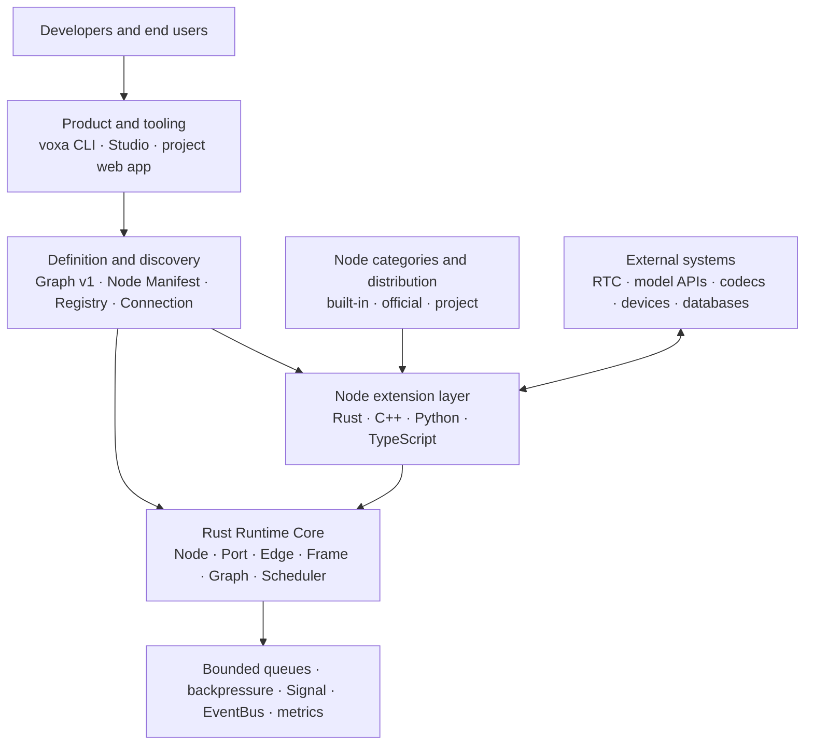
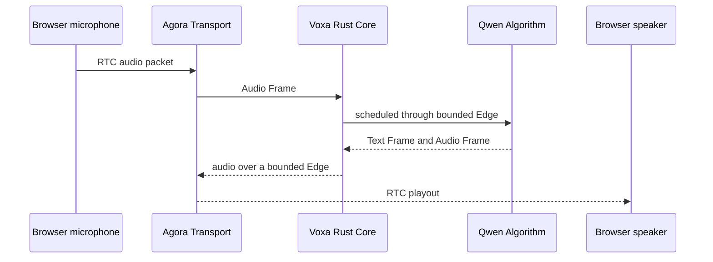

# Understand Voxa: the system map

Voxa is not an ASR, LLM, or TTS SDK, and it is not a flowchart that only runs
inside a web editor. It is a **real-time multimodal Agent Runtime**. Developers
place audio, video, text, bytes, and control messages into a typed Graph. Voxa
owns scheduling, concurrency, backpressure, Signal routing, shutdown, and
observability, while replaceable Nodes supply algorithms, interruption policy,
and external services.

Think of a voice Agent as a factory:

- a **Frame** is the item moving through the factory;
- a **Node** is a machine that processes an item;
- a **Port** is a machine input or output with an exact specification;
- an **Edge** is a bounded conveyor between two machines;
- a **Graph** is the factory blueprint; and
- the **Rust Runtime** starts, schedules, limits, stops, and recovers the factory.

## The complete layer model

### 1. Rust Runtime Core: the stable kernel

Rust Core defines the semantics every implementation must follow: Frame
ownership, Node lifecycle, Port types, Edge queues, Graph validation,
concurrent execution, cancellation, and observability. It does not depend on
Agora, Qwen, or another vendor, so changing a model or RTC service does not
require a new Runtime.

Continue with [Rust Core and its objects](core-runtime.md).

### 2. Node extension layer: business capabilities become building blocks

ASR, VAD, LLM, TTS, audio resampling, and database access can all be Nodes. A
Node emits Frames through named Ports using `NodeContext`, sends adjacent
Signals, or publishes global Events. Business code never calls a downstream
Node directly and never owns an Edge queue.

Continue with [Extending Voxa with Nodes](extensibility.md).

### 3. Multi-language execution: one contract, four languages

Rust, C++, Python, and TypeScript use different Hosts and ABIs, but all of them
register the same Node Factory model and consume the same Frame contract. The
implementation language does not change Graph semantics.

Continue with [Multi-language execution](languages.md).

### 4. Node categories: vendor code stays outside Core

Voxa presents one extension concept to developers: the Node. `builtin.*` Nodes
ship with the Runtime; official Agora and Qwen Nodes demonstrate multi-language
integrations; project Nodes live under `.voxa/nodes/`, where Studio can inspect
and edit their source. `voxa.node.json` declares capability, configuration, and
I/O schemas. A Connection only shares local credentials among Nodes—it is not
another runtime entity.

Continue with [Node architecture](provider-architecture.md).

### 5. Product and tooling: several entrances to one Runtime

The `voxa` CLI creates, validates, runs, and diagnoses projects. Studio edits a
Graph visually and shows Node source and live metrics. A project web app owns
microphone, camera, or end-user interaction. All three use the same Graph and
Registry; they are not separate runtime models.

Continue with [CLI, Studio, and the web surface](developer-surfaces.md).

## How one audio Frame crosses the system

Agora does not know how the Graph is scheduled. Qwen does not know how the
browser captures audio. The browser never receives the model key. Rust Core
contains no vendor business logic. The layers cooperate through explicit
contracts.

Continue with [the real voice path](voice-architecture.md).

## Recommended reading order

For a first visit, read:

1. this page for the system map;
2. [Rust Core and its objects](core-runtime.md);
3. [Graph and typed Ports](graph.md);
4. [Real-time flow and control](realtime-control.md);
5. [Node extensibility](extensibility.md) and [multi-language execution](languages.md);
6. [Node architecture](provider-architecture.md);
7. [CLI, Studio, and web](developer-surfaces.md); and
8. [the real voice path](voice-architecture.md) and [runnable demo](voice-demo.md).
