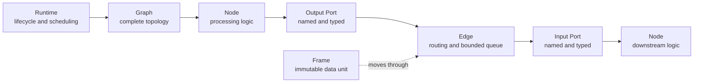
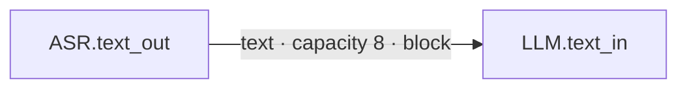

# Rust Core and its objects

Muxiva is reliable because **Rust Runtime Core alone defines how data flows,
work stops, and errors propagate**. Algorithm Nodes may use different
languages, but they cannot invent independent queues, lifecycle rules, or
message formats.

## The six essential objects



### Frame: the only data unit

A Frame is the only value transported between Nodes. It contains a Header and
a Payload:

```text
Frame
├── Header
│   ├── frame_id / stream_id / trace_id
│   ├── timestamp + clock_domain
│   ├── sequence_id
│   ├── metadata / extensions
│   └── lineage
└── Payload
    ├── Audio
    ├── Video
    ├── Text
    ├── Byte
    ├── Signal
    └── Event
```

Frames are immutable after construction. Branches can safely share the
underlying Buffer. A Transform derives a new Frame and records lineage instead
of mutating its input. This makes concurrency, tracing, and fault diagnosis
predictable.

Audio and Video are not unstructured bytes. They include validated sample
rate, channels, sample format, pixel format, planes, and dimensions. Two
`audio` Ports may still require different media formats. Port schemas describe
that detail, and a Resample or Codec Node must perform an explicit conversion.

Implementation: `muxiva-types`.

### Node: one focused responsibility

A Node is a processing component with typed Ports and one lifecycle. Its graph
role is one of:

| Kind | Input and output | Examples |
| --- | --- | --- |
| Source | Produces Frames | microphone, timer, file reader |
| Transform | Consumes and produces Frames | ASR, LLM, TTS, resampler |
| Sink | Consumes Frames | speaker, stdout, storage |

Every language follows the same lifecycle:

```text
on_prepare
    ↓
on_process  ← may run many times
    ↓
on_finish   ← normal completion

on_abort    ← failure, cancellation, or forced stop
```

`on_process` does not need to return output. A Node uses its Context to make
each action explicit:

```python
def on_process(self, frame, ctx):
    ctx.emit("text_out", output_frame)
    ctx.emit_signal("muxiva.turn.interrupt", {"reason": "barge-in"})
    ctx.publish_event("app.transcript.ready", {"text": frame.text})
```

One callback can emit zero, one, or many Frames, or only publish control data.

Implementation: `muxiva-core::node`.

### Port: a typed Node socket

A Port has a name, direction, and exact Frame Type:

```text
audio_in  · input  · audio
text_out  · output · text
```

The Graph never guesses a Port from a Node name and has no `any` type. A
connection spells out `microphone.audio_out -> asr.audio_in`, and both Frame
Types must match exactly.

Official or project Nodes can add a detailed schema such as PCM S16LE, 16 kHz, mono, and
20 ms. Studio displays this contract directly.

### Edge: a bounded conveyor

An Edge is more than a line on a canvas. It defines:

- the exact output and input Ports;
- the single transported Frame Type;
- queue capacity;
- overflow behavior when the queue is full; and
- Edge metrics and lineage attribution.



Capacity is always bounded. An unbounded real-time queue turns a brief service
stall into uncontrolled memory use and stale responses seconds or minutes
later.

Implementation: `muxiva-core::edge`, `queue`, and `flow`.

### Graph: a declaration, not a running object

A Graph Definition stores Nodes, Edges, configuration, and topology. It does
not store running threads, sockets, model clients, or Node instances. The same
Graph can be validated by the CLI, edited by Studio, compiled by Runtime, and
checked deterministically by tests.

Graph v1 is currently a static directed acyclic graph. Build-time validation
rejects duplicate IDs, missing Ports, wrong directions, type mismatches,
zero-capacity queues, and cycles.

Implementation: `muxiva-core::graph` and `muxiva-graph-json`.

### Registry and Factory: resolve declarations to code

The Graph declares which implementation it needs. The Registry owns executable
Factories. Their exact identity is:

```text
node_type + language + factory_version
```

For example, `qwen.asr_realtime + python + 1.0.0`. Runtime does not
guess a version or silently switch languages. After validation, a Factory
creates an independent runtime instance for each Graph Node ID.

Implementation: `muxiva-core::registry` and `foreign_registry`.

### Runtime: bring the Graph to life safely

Runtime:

1. creates Node workers in topology order;
2. calls `on_prepare`;
3. schedules Sources and Edge queues;
4. delivers each Frame to the correct Node and input Port;
5. collects emissions, Signals, Events, and metrics;
6. finishes on success or aborts after failure or cancellation; and
7. waits within a bound for every worker and external domain to close.

Business Nodes neither need nor receive permission to implement this scheduler.

Implementation: `muxiva-core::runner`, `concurrent`, and `registered_runtime`.

## Rust crate responsibilities

| Crate | Responsibility |
| --- | --- |
| `muxiva-types` | Frames, Buffers, time, IDs, schemas, lineage, and errors |
| `muxiva-core` | Nodes, Ports, Edges, Graph, Registry, Runtime, and control plane |
| `muxiva-graph-json` | Graph v1 JSON, built-in Registry, and compilation |
| `muxiva-ffi` | Stable C ABI and C++ Node Pack loading |
| `muxiva-testkit` | Deterministic tests, probes, clocks, and fault injection |

Next, read [Graph and typed Ports](graph.md) and
[real-time flow and control](realtime-control.md).
