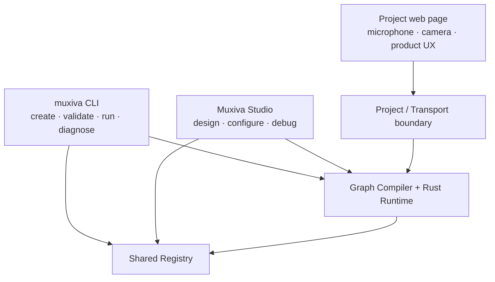

# CLI, Studio, and web

The CLI, Studio, and a project web page are not three runtimes. They are different entry points
to the same Graph, Registry, and Rust Core: the CLI serves engineering and automation, Studio
serves design and debugging, and the project web page serves the end user.



## The `muxiva` CLI: a scriptable entry point

After installation, use the `muxiva` binary directly. Running through `cargo run` is not required.

| Command | When to use it | Executes a Graph |
| --- | --- | --- |
| `muxiva init my-agent` | Create a Graph and project Node directories | No |
| `muxiva validate my-agent` | Check identity, configuration, Ports, and topology before CI or a run | No |
| `muxiva run my-agent` | Execute a project with the concurrent Runtime | Yes |
| `muxiva studio` | Discover a project and open the local visual environment | Only after the user selects Run |
| `muxiva doctor --voice` | Check tools, official Nodes, native libraries, and voice credential readiness | No |
| `muxiva simulate --scenario voice` | Run a network-free fixture for Runtime control flow | Yes, with synthetic data |

`simulate` is an engineering tool for the Runtime, not a real ASR, LLM, or TTS product demo.
Start a real voice experience with the [flagship voice guide](voice-demo.md).

## Studio: a local Graph and Node workbench

Studio ships with the CLI and listens on `127.0.0.1` by default. It reads and writes Graph v1
directly and provides:

- drag-and-drop Nodes and connections from an output Port to a compatible input Port;
- filters for Transport, Algorithm, Media, Control, Utility, and Capability;
- an Inspector with Manifest data, detailed Port schemas, configuration, source, and guides;
- a Node Lab for creating, editing, and registering project Nodes;
- validation and execution of the canvas with Node callbacks, Edge queues, drops, events, and
  results;
- local Node credentials in Connections, without writing their values to the Graph.

Studio is a local development tool, not a production control plane to expose to the internet.
See [Muxiva Studio](studio.md) for the complete workflow.

## Project web pages: the end-user entry point

A project can provide a page under `.muxiva/web/`. The Voice Room, for example:

1. asks for browser microphone permission;
2. joins a channel with the Agora Web SDK;
3. publishes user audio and plays agent audio;
4. displays session state, transcripts, interruptions, and errors.

The page does not execute Python model code or hold a Qwen API key. Media and live interaction
events travel through Transport Nodes; the page neither polls EventBus nor controls Runtime
lifecycle. The local Studio endpoint only bootstraps explicitly `client_exposed` connection fields.
Production deployments replace it with an application backend and short-lived token service.

## How the entry points work together

A typical development loop is:

```text
muxiva init → muxiva studio → connect/write Nodes → Validate → Run → open the project web experience
                         └────────── the same Graph v1 ──────────┘
```

After commit, CI repeats the same contract checks with `muxiva validate` and tests. Deployment can
use `muxiva run` or embed the Runtime in a service without shipping Studio.
