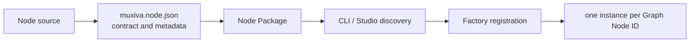

# Node extensibility

A Node is Muxiva's extension unit. Adding ASR, tool use, a database, audio processing, or a
custom model does not require changing the Runtime. Implement the shared lifecycle and register
the implementation as a discoverable Node Factory.

## From source code to a running instance



- The **implementation** contains lifecycle and business logic.
- The **Node Manifest** declares identity, language, Ports, configuration schema, category,
  and entrypoint.
- A **Node Package** is the distributable directory.
- A **Factory** validates configuration and creates instances.
- An **instance** belongs to one Graph Node ID and does not silently share mutable state.

## The Manifest is shared by Studio and the Runtime

`muxiva.node/v1` answers these questions:

| Field | Purpose |
| --- | --- |
| `node_type` | Stable capability name |
| `language` | Select the Rust, C++, Python, or TypeScript Host |
| `factory_version` | Select an exact Factory contract version |
| `kind` | Source, Transform, or Sink |
| `category` / `capability` | Node Library classification and search |
| `ports` | Names, directions, Frame types, and detailed schemas |
| `config_schema` | Studio forms and build-time configuration validation |
| `entrypoint` | Executable implementation inside the Package |

A Graph references this identity and declarative configuration. It does not embed arbitrary
executable code or credentials.

## NodeContext is the Runtime boundary

Lifecycle callbacks receive `ctx`, which exposes controlled capabilities:

```python
class TranscriptNode:
    def on_process(self, frame, ctx):
        if not frame.text.strip():
            return                    # no more work in this callback
        ctx.emit("text_out", frame)    # data plane; may be called repeatedly
        ctx.publish_notification(
            "app.transcript.ready", {"text": frame.text}
        )
```

Output is not a return value. One callback can emit zero, one, or many Frames, or only a Signal
or Event. A Node does not call a downstream Node directly, own an Edge queue, or bypass the
Runtime with unmanaged global threads.

## Discovery locations

Studio and the CLI discover Packages in trusted locations, including project-local
`.muxiva/nodes/` and configured official Node roots. The Node Library displays the Manifest, Port
schemas, configuration, and source code. A developer can create or edit a project Node in
Studio, import it into the Library, and place it on the canvas.

## Recommended development flow

1. Define inputs, outputs, and failure behavior first.
2. Create `muxiva.node.json` and a minimal implementation.
3. Import it with `muxiva studio` and inspect Ports and configuration forms.
4. Connect the Node in an example Graph.
5. Run `muxiva validate <project>` to check identity, types, and topology.
6. Test success, slow-consumer, cancellation, and error paths.
7. Distribute it as a project Node or an official Node Pack.

Choose an implementation language in [multi-language execution](languages.md), then follow the
[Build Nodes](nodes/index.md) tutorials.
