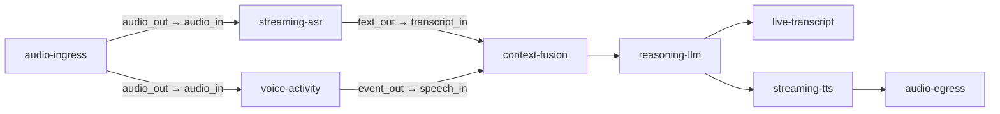
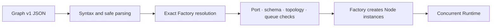

# Graphs and typed Ports

Graph v1 is a reviewable, version-controlled runtime declaration. It selects Node Factories,
configures instances, connects Ports, and defines congestion behavior. A Graph contains no
running threads, remote clients, secrets, or arbitrary scripts.

## Graphs branch and join



One output Port may feed several Edges, each with its own bounded queue. A join Node receives
different Frame types through separate input Ports. The Runtime retains lineage and independent
backpressure metrics for every branch.

## Document structure

This shortened example omits Nodes and Edges that a production document would include:

```json
{
  "version": "muxiva.graph/v1",
  "graph_id": "voice-agent",
  "nodes": [
    {
      "id": "asr",
      "node_type": "qwen.asr_realtime",
      "language": "python",
      "factory_version": "1.0.0",
      "node_config": {"model": "qwen3-asr-flash-realtime"}
    },
    {
      "id": "llm",
      "node_type": "qwen.llm_stream",
      "language": "python",
      "factory_version": "1.0.0",
      "node_config": {}
    }
  ],
  "edges": [
    {
      "id": "asr-to-llm",
      "source": {"node": "asr", "port": "text_out"},
      "target": {"node": "llm", "port": "text_in"},
      "frame_type": "text",
      "capacity": 8,
      "overflow": "block"
    }
  ]
}
```

## Factory identity finds exact code

A Graph resolves a Factory with this tuple:

```text
node_type + language + factory_version
```

The validator does not guess a version or silently switch languages. `id` is the local instance
name in this Graph, while `node_type` is the stable capability identity supplied by a Package.
The same Factory can create several independently configured instances.

## Port type and Port schema

A Port accepts exactly one Frame type: `audio`, `video`, `text`, `byte`, `signal`, or `event`.
There is no untyped `any` Port. An Edge is valid only when both endpoint types match exactly.

A Frame type answers "is this audio?" A detailed Port schema answers "which audio?", for example:

```text
audio / pcm_s16le / 16000 Hz / mono / 20 ms
```

If an upstream Node emits 48 kHz but downstream requires 16 kHz, insert an explicit Resample
Node. The Runtime does not convert it invisibly. Cost, latency, and quality changes therefore
remain visible in the Graph.

## Edges and queue policy

An Edge is both a route and a bounded buffer:

| Business requirement | Suggested policy | Reason |
| --- | --- | --- |
| Text must remain complete | `block` | Exchange producer speed for completeness |
| Live video needs only the newest image | `drop_oldest` | Avoid displaying stale content |
| New data must not disturb the current batch | `drop_newest` | Preserve already accepted work |
| Congestion invalidates the protocol | `abort` | Fail fast with an explicit error |

More capacity is not automatically better. Capacity is the accepted burst size and directly
affects worst-case latency and memory use.

## From JSON to execution



`muxiva validate <project>` performs the first stages without running a Node. `muxiva run <project>`
creates instances and external resources only after compilation succeeds. Studio uses the same
Compiler, so canvas validation does not create a second set of rules.

## Security constraints

Graph JSON cannot contain executable source, dynamic scripts, real credentials, or arbitrary
remote resources. It references trusted Factories and declarative configuration. Executable
code belongs to a [Node Package](extensibility.md), and external-service credentials use a
[Node Connection](provider-architecture.md).

Next: [real-time flow and control](realtime-control.md).
