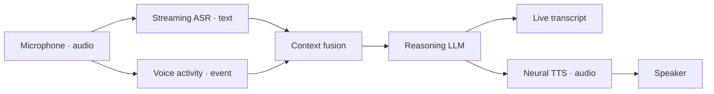

# Voxa

**A real-time multimodal agent runtime with one graph and lifecycle contract
across Rust, C++, Python, and TypeScript.**

Voxa owns scheduling, bounded queues, backpressure, cancellation, lifecycle,
control messages, and observability. Applications provide Nodes for speech,
reasoning, media, transport, and business logic.

!!! warning "Pre-alpha"
    The runtime foundation is tested, but public packages and provider
    integrations are still evolving. Do not execute untrusted Node code or
    expose Studio directly to the internet.

## Experience the architecture

```bash
voxa demo
voxa studio examples/graphs/mock-realtime-voice.v1.json
```



The demo providers are explicitly marked as mocks. Graph compilation,
immutable Frames, fork/join routing, bounded queues, concurrent scheduling, and
lifecycle execution are real Voxa Runtime behavior.

## Choose your path

| Goal | Start here |
| --- | --- |
| Install and run a graph | [Installation and first run](getting-started.md) |
| Build visually | [Voxa Studio](studio.md) |
| Understand the runtime | [Runtime architecture](concepts.md) |
| Write a Node | [Node packages](nodes/index.md) |
| Integrate RTC or media | [Providers](integrations.md) |
| Contribute safely | [Contributing](contributing.md) |

[Open the quick start](getting-started.md){ .md-button .md-button--primary }
[Build a Node](nodes/index.md){ .md-button }
