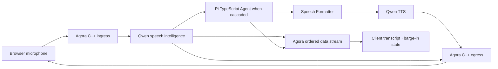

# Muxiva

<p align="center">
  
</p>

**A real-time multimodal agent runtime with one graph and lifecycle contract
across Rust, C++, Python, and TypeScript.**

Muxiva owns scheduling, bounded queues, backpressure, cancellation, lifecycle,
control messages, and observability. Applications provide Nodes for speech,
reasoning, media, transport, and business logic.

!!! warning "Pre-alpha"
    The runtime foundation is tested, but public packages and official Node
    integrations are still evolving. Do not execute untrusted Node code or
    expose Studio directly to the internet.

## Experience a real voice agent

```bash
./examples/voice-agent/setup.sh
./examples/voice-agent/run.sh
```



This credentialed flagship application captures a real microphone in the
browser, transports real audio through Agora, and uses Qwen for speech
understanding and generation. Studio offers a low-latency Realtime graph and an
inspectable full-duplex Qwen Server VAD + ASR → tool-using Pi TypeScript Agent →
Speech Formatter → cancellable Qwen TTS graph with live Node, Tool Call, Frame, and conversation state.

[Run the flagship voice demo](voice-demo.md){ .md-button .md-button--primary }
[Open the Studio guide](studio.md){ .md-button }

## Choose your path

| Goal | Start here |
| --- | --- |
| Run a real voice assistant | [Flagship voice demo](voice-demo.md) |
| Install and run a graph | [Installation and first run](getting-started.md) |
| Build visually | [Muxiva Studio](studio.md) |
| Understand the runtime | [Runtime architecture](concepts.md) |
| Integrate an existing Agent | [Agent integration SOP](nodes/agent-integration.md) |
| Build an Agent application or Node | [Developer manual](nodes/index.md) |
| Integrate RTC or media | [Official and custom Nodes](integrations.md) |
| Contribute safely | [Contributing](contributing.md) |

[Open the developer manual](nodes/index.md){ .md-button }
