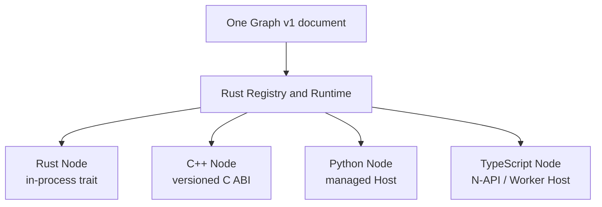

# Multi-language execution

Voxa is not four incompatible SDKs. The Rust Core defines Graph, Frame, Port, lifecycle, and
control semantics. Language adapters only carry callbacks and data safely across a boundary.

## Choosing a language

| Language | Best fit | Integration boundary | Main trade-off |
| --- | --- | --- | --- |
| Rust | Runtime features, high-throughput media, built-ins | In-process `Node` trait | Best control and performance; steeper learning curve |
| C++ | RTC, codecs, existing native SDKs | Versioned C ABI / Node Pack | Natural native SDK access; memory and threads need discipline |
| Python | Model APIs, algorithm orchestration, fast iteration | Managed Python Host | Rich ecosystem; more boundary overhead than in-process Rust |
| TypeScript | Web ecosystem, application integrations, JS teams | N-API / Worker Host | Productive development; asynchronous and Worker lifecycle matters |

The language does not change a Port contract. A `text` Frame from Python ASR can enter a Rust
Transform or C++ Sink, while the Runtime applies the same queues, backpressure, turn, and
shutdown rules.

## Four rules at every boundary

1. **The Frame contract stays intact.** A Host preserves identity, time, sequence, media
   descriptors, and lineage.
2. **Output is explicit.** Every language uses Context to emit Frames, Signals, and Events.
3. **Lifecycle remains paired.** A successful prepare ends in finish or abort, and foreign
   threads must exit within a bound.
4. **Failure is structured.** Exceptions, ABI errors, and process exits become Runtime errors;
   they are never silently discarded.

## Source code does not live in the Graph

A Graph stores only `node_type + language + factory_version` and configuration. Source code,
shared libraries, Python packages, and JavaScript packages live in trusted Node Packages loaded
by a Factory or Host. This separates reviewable topology from the executable supply chain.

## Layered Provider example

- Agora Transport Nodes use C++ close to the official native SDK, audio callbacks, and RTC
  lifecycle.
- Qwen Algorithm Nodes use Python close to model APIs, streaming events, and rapid algorithm
  iteration.
- The Rust Core sees only standard Frames and lifecycle callbacks; it imports no Agora or Qwen
  business code.

Start with a language guide: [Rust](nodes/rust.md) · [C++](nodes/cpp.md) ·
[Python](nodes/python.md) · [TypeScript](nodes/typescript.md).
