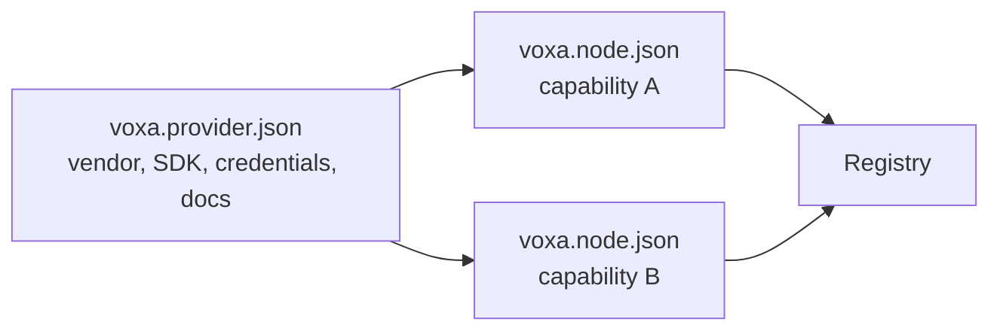

# Provider architecture

A Provider adapts an external vendor capability to the Voxa Node contract. It is a business
extension, not part of the Rust Core. Qwen request parameters, Agora tokens, and vendor error
codes do not belong in Core.

## Two manifest levels



- `voxa.provider/v1` describes the Provider: ID, category, vendor, SDK, license, connection
  fields, and official documentation.
- `voxa.node/v1` describes one concrete Node: capability, language, entrypoint, configuration,
  Ports, and schemas.

One Provider can therefore expose several Nodes while shared connection fields such as API key
and endpoint are declared once.

## Provider categories

| Category | Responsibility | Examples |
| --- | --- | --- |
| Transport | Convert an external real-time stream to Frames, or send it back | Agora RTC, WebSocket |
| Algorithm | Understand or generate content | VAD, ASR, LLM, TTS, realtime model |
| Media | Change media representation without semantic reasoning | Resample, AEC, codec, mixer |
| Control | Identity, session, policy, or tool control | Auth, turn policy, tool router |
| Utility | Storage, logging, and general integration | Object storage, database, telemetry |

A category describes responsibility; `kind` describes the Graph role. They are different. ASR
is an Algorithm category and is usually a Transform kind.

## The directory layout enforces the boundary

```text
providers/
├── transport/
│   └── agora/
│       ├── voxa.provider.json
│       └── cpp/nodes/...
└── algorithm/
    └── qwen/
        ├── voxa.provider.json
        └── python/nodes/...
```

Agora C++ and Qwen Python code stay under their Provider roots; the Rust Core does not depend on
them. Studio scans Provider roots and presents their Nodes by category, vendor, and capability.

## Credential boundary

A Manifest declares credential fields but never stores real values. Developers configure them
in Studio Connections or environment variables. The server sends only non-secret fields
explicitly marked `client_exposed` to a web client. A model API key must never enter Graph JSON,
source control, or the browser.

## Adding a Provider

1. Choose Transport, Algorithm, Media, Control, or Utility.
2. Create the Provider Manifest with SDK, license, download link, and connection fields.
3. Create a separate Node Package and Port schema for each capability.
4. Implement it in the appropriate language and emit through Context.
5. Test missing configuration, network failure, cancellation, reconnection, and shutdown.
6. Document the complete path from obtaining credentials to running an example.
7. Verify discovery, filters, source code, and schema display in the Studio Node Library.

Explore current implementations in the [Provider catalog](providers/index.md).
