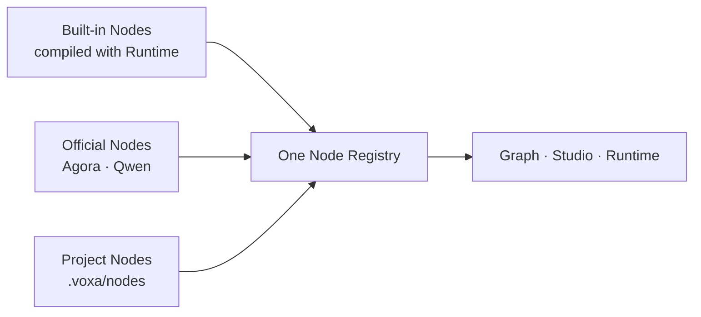

# Node architecture

Voxa Runtime executes only Nodes. There is no separate Provider runtime entity. Agora, Qwen,
and FFmpeg are namespaces for officially maintained Nodes; they use the same Manifest, Ports,
Frames, lifecycle, and Registry as project Nodes.

| Source | Examples | Meaning |
| --- | --- | --- |
| Built-in | `builtin.audio_resampler` | Generic and vendor-independent |
| Official | `agora.audio_source`, `qwen.audio_realtime` | Maintained integrations and examples |
| Project | `my_agent.rag` | Developer-owned code under `.voxa/nodes/` |

A Node Manifest may declare a `connection_id`; secrets are stored in the project's `.env`.
Connection configuration does not create another runtime abstraction.

Developers can copy an official Node layout into `.voxa/nodes/<package>/` and implement Rust,
Python, TypeScript, or C++. Studio discovers it and shows it in the same Node Library.
