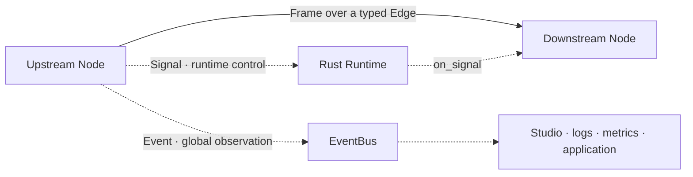

# Real-time flow and control

A real-time agent does more than pass A's output to B. It must decide what happens when a
consumer slows down, how an interruption stops an old answer, and which messages belong to
the business pipeline versus observability.

Voxa separates the data plane from the control plane:

## Frames carry business data

Audio, video, text, and byte Frames travel over Graph Edges. Port types, queue capacity,
overflow policy, and topology govern their delivery. Receiving a Frame causes the downstream
Node's `on_process` callback to run.

## Signals change runtime state

Signals express interruption, cancellation, turn changes, and other runtime control. A Node
calls `ctx.emit_signal(...)`; the Runtime owns propagation and handling. Control information
does not need to masquerade as ordinary text or audio.

A common example is barge-in. When a user speaks while the agent is playing an answer, the VAD
Node emits an interruption Signal. The Runtime ends the old turn, cancels old generation, and
prevents stale audio from reaching the speaker.

## EventBus lets observers see what happened

Events are globally observable notifications such as a completed transcript, first-token
arrival, Provider reconnection, or excessive latency. A Node calls `ctx.publish_event(...)`.
Studio, logs, metrics, or application subscribers can observe the event, but an Event does not
replace business data flowing through the Graph.

| Requirement | Use |
| --- | --- |
| Send audio to ASR | Frame + Edge |
| Tell the Runtime to stop an old answer | Signal |
| Show a transcript or latency in Studio | EventBus Event |
| Send LLM text to TTS | Frame + Edge |

## Bounded queues and backpressure

Every Edge queue has a fixed capacity. A full queue follows an explicit policy:

| Policy | Behavior | Typical use |
| --- | --- | --- |
| `block` | Wait for downstream capacity | Text or commands that must stay complete |
| `drop_oldest` | Remove the oldest Frame to stay current | Live audio or video preview |
| `drop_newest` | Preserve already queued data | Stable batch processing |
| `abort` | Fail and begin shutdown | Protocols where loss is unacceptable |

An unlimited queue appears lossless but turns a short slowdown into high latency and unbounded
memory use. Voxa makes capacity and policy explicit so latency, completeness, and failure
behavior remain predictable.

## Turns and interruption

A turn is one interaction that can be managed as a unit. Frame identity, time, and lineage let
the Runtime determine which turn produced a result. On interruption, the system must:

1. mark the old turn as canceled;
2. notify Providers and Nodes that support cancellation;
3. remove or ignore stale queued Frames;
4. reject late results from the old model request;
5. let the new turn run immediately.

This is more reliable than a boolean inside a TTS Node because interruption affects model
generation, queues, playback, and observation together.

## Lifecycle and shutdown

A normal run follows `prepare → process → finish`; errors, timeouts, or cancellation enter
`abort`. The Runtime uses bounded waits for workers and foreign execution domains so a process
cannot report completion while a background thread still owns a microphone, connection, or
model stream.

Next: [Node extensibility](extensibility.md) and the [end-to-end voice path](voice-architecture.md).
