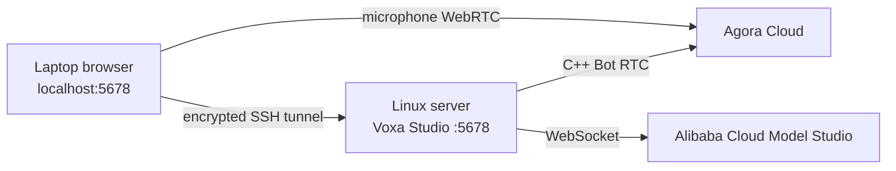

# Headless Linux and remote Studio

Studio is a local HTTP service started by `voxa`; its browser does not need to run on the same
machine as the Runtime. On a headless Linux server, keep Studio on server loopback and use SSH
port forwarding to open it in Chrome, Edge, or Safari on your own computer.



The page and microphone run on your computer. Graphs, Python/C++ Providers, logs, and `.env`
remain on Linux.

## Recommended: SSH port forwarding

### 1. Start a fixed server port

For a normal project:

```bash
cd /srv/my-agent
voxa studio . --host 127.0.0.1 --port 5678 --no-open
```

For the flagship voice demo in the repository:

```bash
cd /srv/Voxa
./examples/voice-agent/run.sh --host 127.0.0.1 --port 5678 --no-open
```

When neither `DISPLAY` nor `WAYLAND_DISPLAY` exists, `run.sh` automatically disables browser
opening. It prints a URL like:

```text
[VOXA][INFO][studio.ready] url=http://127.0.0.1:5678/#<ACCESS_TOKEN>
```

Keep the process running. Do not share the complete URL containing the access token.

### 2. Create the tunnel on your computer

Open another local terminal:

```bash
ssh -N -L 5678:127.0.0.1:5678 user@your-linux-server
```

With a custom SSH port and identity file:

```bash
ssh -p 2222 -i ~/.ssh/your_key -N \
  -L 5678:127.0.0.1:5678 user@your-linux-server
```

### 3. Open the complete URL locally

Paste the server's complete URL, including the fragment token, into your local browser:

```text
http://127.0.0.1:5678/#<ACCESS_TOKEN>
```

Voice Room requests access to the microphone on your **local computer**. The browser joins Agora
directly, while the C++ Bot on Linux joins the same channel with its separate UID.

## Keep Studio alive after SSH disconnects

Use `tmux` or `systemd`. A minimal `tmux` workflow is:

```bash
tmux new -s voxa
./examples/voice-agent/run.sh --host 127.0.0.1 --port 5678 --no-open
```

Press `Ctrl-b`, then `d` to detach. Reconnect later with:

```bash
tmux attach -t voxa
```

Follow logs with:

```bash
tail -f examples/voice-agent/.voxa/runtime.log
```

## Run in a container

Listen on all interfaces inside the container, but bind the published host port to loopback:

```bash
docker run --rm \
  -p 127.0.0.1:5678:5678 \
  your-voxa-image \
  voxa studio /app --host 0.0.0.0 --port 5678 --no-open
```

If Docker runs on your computer, replace the printed hostname with `127.0.0.1:5678` while keeping
the original `#<ACCESS_TOKEN>`. If Docker is remote, use the SSH tunnel above.

## Not recommended: expose Studio directly

This listens on LAN or public interfaces:

```bash
voxa studio . --host 0.0.0.0 --port 5678 --no-open
```

Studio can edit Graphs, save Connections, and start Runtimes. Do not expose it directly to the
internet. Plain remote HTTP also normally cannot obtain browser microphone permission. If remote
sharing is unavoidable, place Studio behind HTTPS, authentication, a network ACL or VPN, and a
firewall. Prefer SSH forwarding for individual development.

## Additional Linux voice-demo requirements

- The Qwen Python Provider needs no GUI and no Qwen SDK; the server must reach Model Studio's
  WebSocket endpoint.
- Your local browser supplies the microphone, so the Linux server needs no audio device.
- The Agora C++ Bot needs an Agora Native SDK matching the Linux architecture. The automatic
  macOS package cannot run on Linux; pass an extracted Linux SDK to setup:

```bash
./examples/voice-agent/setup.sh /opt/agora-linux-sdk
```

- The server and local browser must both reach Agora. Enterprise firewalls must allow the domains
  and ports required by Agora.

## Troubleshooting

| Symptom | Resolution |
| --- | --- |
| Server reports an `xdg-open` failure | Add `--no-open`; current `run.sh` adds it automatically on headless Linux |
| Local browser refuses connection | Keep Studio and the SSH tunnel running and use the same `5678` port |
| Access token is invalid | Copy the complete URL from the current launch, including the fragment |
| Studio opens but microphone is unavailable | Use the tunneled local `127.0.0.1` URL, not remote plain HTTP |
| Browser joins but the Bot does not | Check the Linux Agora SDK, bot token, server network, and runtime log |

Next: [obtain voice credentials](voice-credentials.md) · [run the flagship voice demo](voice-demo.md).
