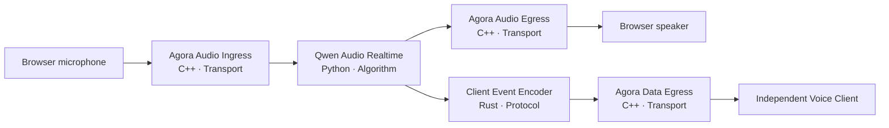
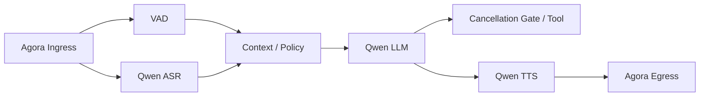
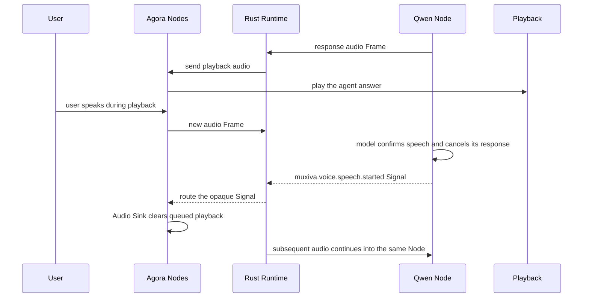

# End-to-end voice path

A real voice path demonstrates Muxiva's layers clearly. The browser owns user experience, Agora
owns network transport, Qwen owns algorithms, and the Rust Core owns real-time scheduling. No
layer needs the internal implementation of another.

## Two Graph choices

### Realtime model Graph

A realtime model combines speech understanding and generation in one streaming model session,
which shortens the path and supports natural interaction:

Choose it when low latency, natural turns, and fewer components are the priority.

### Cascade Graph

A cascade separates capabilities so each model can be selected independently and intermediate
results or business logic can be inserted:

Choose it when the application needs custom VAD, prompts, tools, moderation, transcripts, or
TTS. Branching and joining are normal Graph capabilities; Muxiva is not limited to a linear
`A → B → C` pipeline.

## What each layer owns

| Layer | Implementation | Owns | Does not own |
| --- | --- | --- | --- |
| Project web | HTML/JS + Agora Web SDK | Microphone permission, channel, playback, interaction UI | Model secrets or Runtime scheduling |
| Official Agora Nodes | C++ Node Pack | One shared RTC session, audio ingress/egress, and reliable ordered client messages | ASR, LLM, or Graph scheduling |
| Runtime Core | Rust | Types, queues, concurrency, opaque Signal routing, shutdown | Vendor requests, voice turns, or product UI |
| Official Qwen Nodes | Python Node Pack | Realtime or ASR/LLM/TTS streams | RTC channels or Edge queues |
| Developer tools | CLI + Studio | Create, configure, validate, run, observe | Production end-user UI |

## Full duplex and barge-in

Full duplex requires more than opening two sockets. An interruption coordinates several layers:

Interruption semantics live entirely in Nodes. The Qwen Node cancels the remote response and
discards late chunks; the Agora Audio Sink clears queued playback and rejects audio at or below
the cancellation sequence. The cascade also places a generic text cancellation gate before TTS.
Core understands neither voice, turns, nor a particular Signal name—it only routes opaque Signals.

## Client data is not Studio telemetry

ASR text, assistant text, and speech state leave the Graph through `agora.data_sink`. The browser
receives `muxiva.client-event/v1` messages from Agora's reliable ordered data stream. It never polls
`/api/v1/runtime/events`, and it cannot start or stop the Runtime. EventBus remains an in-process
observability facility for logs and Studio operators; it is not the end-user transport contract.

The local `/api/v1/client/session` endpoint only bootstraps temporary browser RTC credentials.
A production deployment replaces that endpoint with its own authenticated short-lived token
service while keeping the same media and message paths.

The first supported isolation model is deliberately strict: one Agora channel equals one Agent
session and one configured browser UID. The shared C++ session drops media and messages from any
other UID rather than accidentally mixing participants.

!!! warning "Cascade cancellation boundary"
    The cancellation gates prevent stale cascade text and audio from reaching TTS, playback, or
    the client. The current synchronous Python HTTP LLM request itself is not preempted mid-call;
    cancellable asynchronous transform execution remains required before claiming hard provider-
    side cancellation for the cascade Graph. Qwen Realtime does cancel provider generation.

## Credential and deployment boundary

- Short-lived Agora RTC tokens can be exposed to the browser with least privilege; production
  uses a token server.
- Qwen API key and workspace ID remain in server-side Connections or environment variables.
- Graph and Node Manifests can enter source control, but real secrets cannot.
- Studio is for local development; a production web app connects through an explicit application
  service boundary.

Run both Graphs by following [Build a real voice agent from scratch](voice-demo.md).
