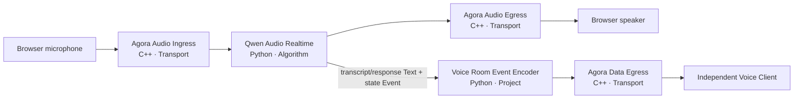
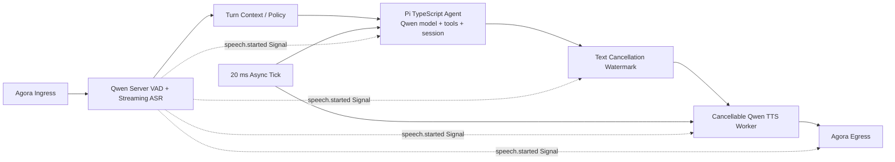
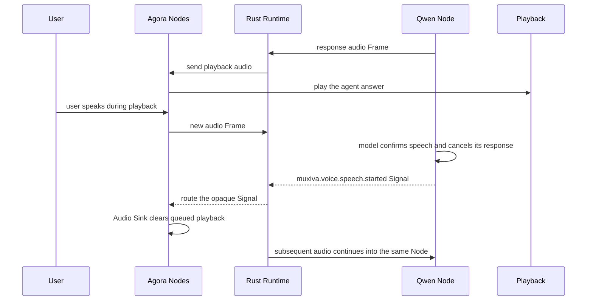

# End-to-end voice path

A real voice path demonstrates Muxiva's layers clearly. The browser owns user experience, Agora
owns network transport, Qwen owns algorithms, and the Rust Core owns real-time scheduling. No
layer needs the internal implementation of another.

## Two Graph choices

### Realtime model Graph

A realtime model combines speech understanding and generation in one streaming model session,
which shortens the path and supports natural interaction:

Choose it when low latency, natural turns, and fewer components are the priority.

### Cascade Graph

A cascade separates capabilities so each model can be selected independently and intermediate
results or business logic can be inserted:

Demo 2 uses Qwen ASR for Server VAD and streaming transcription, a project-local Pi
TypeScript Agent backed by Qwen for conversation state and Tool Calls, and Qwen TTS.
The generic `interval_tick` lets background Agent/TTS work drain bounded queues in short
callbacks, keeping `on_signal` responsive. Every stage remains replaceable.

## What each layer owns

| Layer | Implementation | Owns | Does not own |
| --- | --- | --- | --- |
| Project web | HTML/JS + Agora Web SDK | Microphone permission, channel, playback, interaction UI | Model secrets or Runtime scheduling |
| Project Nodes | Python + TypeScript | Voice Room protocol plus Pi Agent session and tools | Runtime primitives or Agora packet limits |
| Official Agora Nodes | C++ Node Pack | One shared RTC session, audio ingress/egress, and reliable ordered client messages | ASR, LLM, or Graph scheduling |
| Runtime Core | Rust | Types, queues, concurrency, opaque Signal routing, shutdown | Vendor requests, voice turns, or product UI |
| Official Qwen Nodes | Python Node Pack | Realtime, ASR, optional LLM, and TTS streams | Agent policy, RTC channels, or Edge queues |
| Developer tools | CLI + Studio | Create, configure, validate, run, observe | Production end-user UI |

## Full duplex and barge-in

Full duplex requires more than opening two sockets. An interruption coordinates several layers:

Interruption semantics live entirely in Nodes. In the Realtime Graph, Qwen Audio cancels its
remote response. In Demo 2, Qwen ASR Server VAD emits the same Signal; the Pi driver calls
`agent.abort()`, Qwen TTS closes the active WebSocket and clears pending text and PCM, text and
project protocol Nodes advance cancellation watermarks, and Agora Audio Sink clears queued playback and rejects
late audio. Core understands neither voice, turns, nor a particular Signal name—it routes opaque
Signals only.

## Client data is not Studio telemetry

ASR text, assistant text, and speech state first pass through the project-local
`voice_room.event_encoder`, then leave the Graph through `agora.data_sink`. The application Node
owns `muxiva.client-event/v1`; the Agora Node owns packetization and reliable ordered delivery. The browser
receives those messages from Agora's data stream. It never polls
`/api/v1/runtime/events`, and it cannot start or stop the Runtime. NotificationBus remains an in-process
observability facility for logs and Studio operators; it is not the end-user transport contract.

The local `/api/v1/client/session` endpoint only bootstraps temporary browser RTC credentials.
A production deployment replaces that endpoint with its own authenticated short-lived token
service while keeping the same media and message paths.

The first supported isolation model is deliberately strict: one Agora channel equals one Agent
session and one configured browser UID. The shared C++ session drops media and messages from any
other UID rather than accidentally mixing participants.

!!! note "Cascade cancellation boundary"
    Demo 2 aborts the in-flight Pi model stream and closes the TTS WebSocket, then applies
    three cancellation watermarks to late results. PCM already inside Agora or the browser's
    playback buffer cannot be recalled, so Audio Sink still uses short packets and bounded queues.
    “Hard interruption” means cancelling vendor connections and the local pipeline, not reversing
    media that has already been transmitted.

## Credential and deployment boundary

- Short-lived Agora RTC tokens can be exposed to the browser with least privilege; production
  uses a token server.
- Qwen API key and workspace ID remain in server-side Connections or environment variables.
- Graph and Node Manifests can enter source control, but real secrets cannot.
- Studio is for local development; a production web app connects through an explicit application
  service boundary.

Run both Graphs by following [Build a real voice agent from scratch](voice-demo.md).
