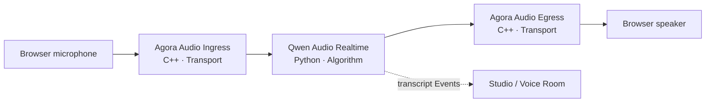
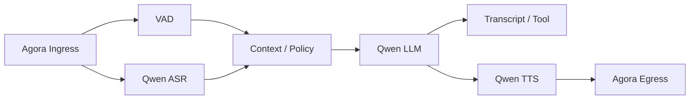

# End-to-end voice path

A real voice path demonstrates Voxa's layers clearly. The browser owns user experience, Agora
owns network transport, Qwen owns algorithms, and the Rust Core owns real-time scheduling. No
layer needs the internal implementation of another.

## Two Graph choices

### Realtime model Graph

A realtime model combines speech understanding and generation in one streaming model session,
which shortens the path and supports natural interaction:

Choose it when low latency, natural turns, and fewer components are the priority.

### Cascade Graph

A cascade separates capabilities so each model can be selected independently and intermediate
results or business logic can be inserted:

Choose it when the application needs custom VAD, prompts, tools, moderation, transcripts, or
TTS. Branching and joining are normal Graph capabilities; Voxa is not limited to a linear
`A → B → C` pipeline.

## What each layer owns

| Layer | Implementation | Owns | Does not own |
| --- | --- | --- | --- |
| Project web | HTML/JS + Agora Web SDK | Microphone permission, channel, playback, interaction UI | Model secrets or Runtime scheduling |
| Official Agora Nodes | C++ Node Pack | RTC ingress/egress and PCM Frame conversion | ASR, LLM, or Graph scheduling |
| Runtime Core | Rust | Types, queues, concurrency, opaque Signal routing, shutdown | Vendor requests, voice turns, or product UI |
| Official Qwen Nodes | Python Node Pack | Realtime or ASR/LLM/TTS streams | RTC channels or Edge queues |
| Developer tools | CLI + Studio | Create, configure, validate, run, observe | Production end-user UI |

## Full duplex and barge-in

Full duplex requires more than opening two sockets. An interruption coordinates several layers:

Interruption semantics live entirely in Nodes. The Qwen Node cancels the remote response and
discards late chunks; the Agora Audio Sink stops queued playback. Core understands neither voice,
turns, nor a particular Signal name—it only broadcasts the opaque Signal reliably. Custom Nodes
can therefore reuse EventBus without placing application policy in the framework core.

## Credential and deployment boundary

- Short-lived Agora RTC tokens can be exposed to the browser with least privilege; production
  uses a token server.
- Qwen API key and workspace ID remain in server-side Connections or environment variables.
- Graph and Node Manifests can enter source control, but real secrets cannot.
- Studio is for local development; a production web app connects through an explicit application
  service boundary.

Run both Graphs by following [Build a real voice agent from scratch](voice-demo.md).
