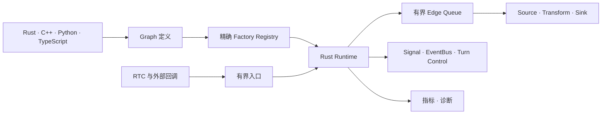

# Runtime 架构

Voxa 将确定性的 Runtime 职责与应用、Provider 行为严格分离。

## Core 的职责

- 不可变类型化 Frame 与 Lineage；
- 精确 Graph 与 Factory 校验；
- 并发调度与有界队列；
- 背压与 Overflow Policy；
- prepare、process、finish、abort 和 shutdown 生命周期；
- 取消、晚到结果与 Managed Stream；
- Signal、全局 Event 和 Turn Control；
- Runtime 指标与确定性测试 Hook。

## Core 之外的职责

ASR、LLM、TTS、RTC 厂商、设备访问、Codec 与模型 API 都属于 Node 或 Adapter，
不能成为 Runtime Core 的强制依赖。

## 多语言边界

Rust 负责调度；C++ 跨越版本化 C ABI；Python 运行在受管执行域；TypeScript
运行在 Node.js Worker。外语对象不会直接跨 Runtime 边界，而是转换为稳定的
Frame 表示。

## 默认有界

队列容量、媒体时长、Payload 大小、在途任务、回调时间、执行期限与关闭期限都
必须有明确上限。能够无限增长的实时系统不被视为安全系统。
