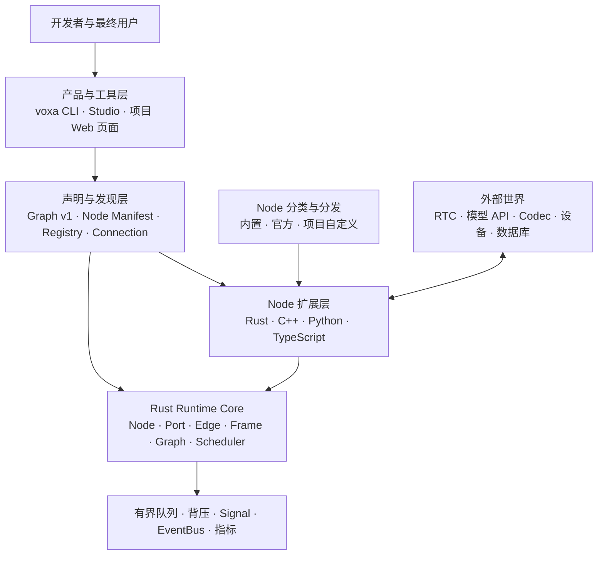
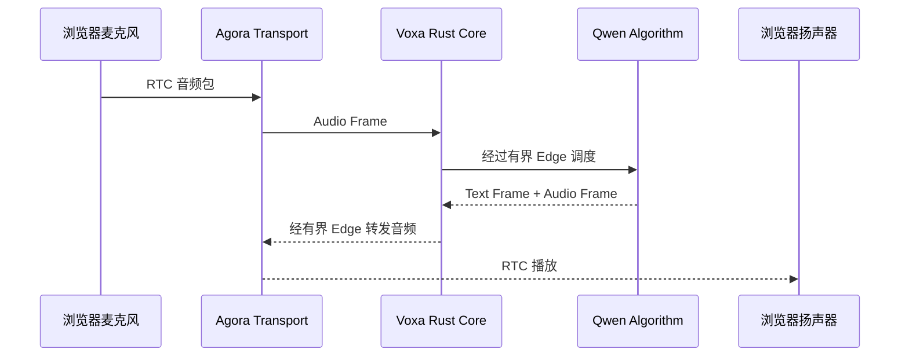

# 先看懂 Voxa：系统全景

Voxa 不是一个 ASR、LLM 或 TTS SDK，也不是一张只能在网页里编辑的流程图。
它是一套**实时多模态 Agent Runtime**：开发者把音频、视频、文本、字节和控制消息
交给一张类型安全的 Graph，Voxa 负责调度、并发、背压、Signal 路由、关闭与可观测性，
具体算法、打断策略和网络服务都由可替换 Node 完成。

如果把一个语音 Agent 比作一座工厂：

- **Frame** 是在流水线上移动的货物；
- **Node** 是加工货物的机器；
- **Port** 是机器上有明确规格的入口和出口；
- **Edge** 是连接两台机器的有界传送带；
- **Graph** 是整座工厂的设计图；
- **Rust Runtime** 是负责开机、调度、限流、停机和处理故障的控制系统。

## 一张图看清全部层级

### 1. Rust Runtime Core：稳定内核

Rust Core 定义所有实现都必须遵守的运行语义：Frame 的所有权、Node 生命周期、
Port 类型、Edge 队列、Graph 校验、并发执行、取消和可观测性。它不依赖 Agora、
Qwen 或其他厂商，因此替换模型或 RTC 不需要重写 Runtime。

继续阅读：[Rust Core 与核心对象](core-runtime.md)。

### 2. Node 扩展层：业务能力变成积木

ASR、VAD、LLM、TTS、音频重采样和数据库查询都可以实现为 Node。Node 通过
`NodeContext` 向具名 Port 发出 Frame，也可以发送 Signal 或发布 Event；业务代码
不直接操作下游 Node，也不管理 Edge 队列。

继续阅读：[Node 如何扩展](extensibility.md)。

### 3. 多语言执行层：一套语义，四种语言

Rust、C++、Python 和 TypeScript 使用不同 Host 与 ABI，但最终都注册为同一种
Node Factory，并消费同一种 Frame 契约。语言只是实现选择，不会改变 Graph 语义。

继续阅读：[多语言执行模型](languages.md)。

### 4. Node 分类：厂商能力留在 Core 外面

Voxa 对开发者只提供一种扩展概念：Node。`builtin.*` 随 Runtime 发布；Agora、Qwen
等官方 Node 展示多语言集成方式；项目 Node 放在 `.voxa/nodes/`，可以直接在 Studio
查看和编辑源码。`voxa.node.json` 描述能力、配置和输入输出 Schema，Connection
只是多个 Node 共享本地凭据的配置，不是另一种运行实体。

继续阅读：[Node 分层架构](provider-architecture.md)。

### 5. 工具与产品层：同一套 Runtime 的不同入口

`voxa` CLI 用于创建、校验、运行和诊断项目；Studio 用于可视化编辑 Graph、查看
Node 源码与实时指标；项目 Web 页面负责麦克风、摄像头或最终用户交互。三者共享
同一份 Graph 和 Registry，不存在三套互不兼容的运行模型。

继续阅读：[CLI、Studio 与 Web](developer-surfaces.md)。

## 一帧音频如何穿过系统

在这个过程中：Agora 不知道 Graph 如何调度，Qwen 不知道浏览器如何采集，浏览器
拿不到模型密钥，而 Rust Core 不包含任何厂商业务代码。各层通过明确契约协作。

继续阅读：[一条真实语音链路如何运行](voice-architecture.md)。

## 推荐阅读顺序

第一次接触 Voxa，建议依次阅读：

1. 当前页面：建立全景认识；
2. [Rust Core 与核心对象](core-runtime.md)：理解 Node、Edge 和 Frame；
3. [Graph 与类型化 Port](graph.md)：看懂 Graph JSON；
4. [实时流控与控制消息](realtime-control.md)：理解背压、Signal、Event 与打断；
5. [Node 如何扩展](extensibility.md)和[多语言执行模型](languages.md)；
6. [Node 分层架构](provider-architecture.md)；
7. [CLI、Studio 与 Web](developer-surfaces.md)；
8. [真实语音链路](voice-architecture.md)与[可运行 Demo](voice-demo.md)。
