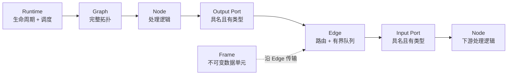
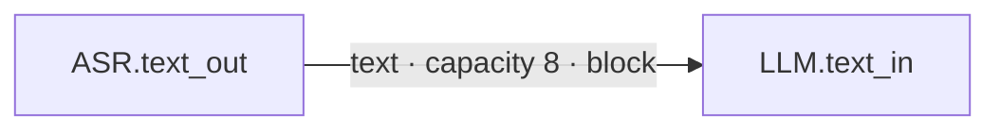

# Rust Core 与核心对象

Muxiva 的可靠性来自一个原则：**数据如何流动、任务如何停止、错误如何传播，只由
Rust Runtime Core 定义**。算法 Node 可以用不同语言实现，但不能各自发明另一套
队列、生命周期或消息格式。

## 六个最重要的对象



### Frame：唯一的数据单元

Frame 是 Node 之间传递信息的唯一载体。它由 Header 和 Payload 组成：

```text
Frame
├── Header
│   ├── frame_id / stream_id / trace_id
│   ├── timestamp + clock_domain
│   ├── sequence_id
│   ├── metadata / extensions
│   └── lineage
└── Payload
    ├── Audio
    ├── Video
    ├── Text
    ├── Byte
    ├── Signal
    └── Event
```

Frame 在创建后不可变。多个分支可以安全共享底层 Buffer；Transform 产生新 Frame
时会记录 Lineage，而不是偷偷修改输入。这让并发、追踪和故障诊断更可靠。

Audio 和 Video 不只是裸字节：它们还带有采样率、声道、Sample Format、Pixel
Format、Plane 和尺寸等受校验信息。两个 Port 都写着 `audio` 并不代表业务格式一定
一致；详细要求由 Port Schema 描述，必要时必须显式加入 Resample 或 Codec Node。

实现位置：`muxiva-types`。

### Node：只处理当前职责

Node 是带有类型化 Port 和统一生命周期的处理组件。它分三种图中角色：

| Kind | 输入与输出 | 常见例子 |
| --- | --- | --- |
| Source | 产生 Frame | 麦克风、定时器、文件读取 |
| Transform | 消费并产生 Frame | ASR、LLM、TTS、重采样 |
| Sink | 消费 Frame | 扬声器、stdout、存储 |

所有语言都遵循同一组生命周期：

```text
on_prepare
    ↓
on_process  ← 可能执行多次
    ↓
on_finish   ← 正常结束

on_abort    ← 错误、取消或强制停止
```

`on_process` 不需要通过 `return` 发送输出。Node 使用 Context 明确表达动作：

```python
def on_process(self, frame, ctx):
    ctx.emit("text_out", output_frame)
    ctx.emit_signal("muxiva.turn.interrupt", {"reason": "barge-in"})
    ctx.publish_event("app.transcript.ready", {"text": frame.text})
```

这样一份处理逻辑可以产生零个、一个或多个输出，也可以只发布控制消息。

实现位置：`muxiva-core::node`。

### Port：Node 的类型化插座

Port 有三个关键属性：名称、方向和 Frame Type。例如：

```text
audio_in  · input  · audio
text_out  · output · text
```

Graph 不会根据 Node 名称猜 Port，也不存在 `any`。连接必须明确写出
`microphone.audio_out -> asr.audio_in`，并且两端 Frame Type 完全一致。

官方或项目 Node 还可以在 Manifest 中声明更具体的 Schema，例如 PCM S16LE、16 kHz、
单声道、20 ms。Studio 会把这份契约直接展示给开发者。

### Edge：有界的传送带

Edge 不只是画布上的一条线。它同时定义：

- 从哪个 Output Port 到哪个 Input Port；
- 允许传输的唯一 Frame Type；
- Queue Capacity；
- Queue 满时的 Overflow Policy；
- Edge 级指标和 Lineage 归因。



Capacity 必须有上限。实时系统如果允许队列无限增长，短暂抖动最终会变成内存失控和
几秒甚至几分钟的陈旧响应。

实现位置：`muxiva-core::edge`、`queue`、`flow`。

### Graph：声明，不是正在运行的对象

Graph Definition 保存 Node、Edge、配置和拓扑。它不保存正在运行的线程、Socket、
模型客户端或 Node 实例。因此同一份 Graph 可以被：

- CLI 校验；
- Studio 展示和编辑；
- Runtime 编译并运行；
- 测试工具确定性检查。

Muxiva 当前 Graph v1 是静态有向无环图。构建阶段会拒绝重复 ID、缺失 Port、方向错误、
类型不匹配、零容量队列和环路。

实现位置：`muxiva-core::graph` 与 `muxiva-graph-json`。

### Registry 与 Factory：从声明找到实现

Graph 只写“我要哪个实现”，Registry 才保存可执行 Factory。精确身份是：

```text
node_type + language + factory_version
```

例如 `qwen.asr_realtime + python + 1.0.0`。Runtime 不猜版本、不自动换
语言，也不会因为名字相似就加载另一个 Node。校验成功后，Factory 为 Graph 中的
每个 Node ID 创建独立运行实例。

实现位置：`muxiva-core::registry` 与 `foreign_registry`。

### Runtime：让整张图安全地活起来

Runtime 负责：

1. 按拓扑创建 Node Worker；
2. 调用 `on_prepare`；
3. 调度 Source 和 Edge 队列；
4. 将 Frame 交给正确 Node 和 Input Port；
5. 收集输出、Signal、Event 和指标；
6. 在成功时 Finish，在错误或取消时 Abort；
7. 有界等待所有 Worker 与外部执行域关闭。

业务 Node 不需要、也不允许自己实现这套调度器。

实现位置：`muxiva-core::runner`、`concurrent`、`registered_runtime`。

## Rust crate 分工

| Crate | 负责什么 |
| --- | --- |
| `muxiva-types` | Frame、Buffer、时间、ID、Schema、Lineage、错误 |
| `muxiva-core` | Node、Port、Edge、Graph、Registry、Runtime 与控制面 |
| `muxiva-graph-json` | Graph v1 JSON、Builtin Registry 与编译 |
| `muxiva-ffi` | 稳定 C ABI 与 C++ Node Pack 加载 |
| `muxiva-testkit` | 确定性测试、探针、Clock 和故障注入工具 |

下一步阅读：[Graph 与类型化 Port](graph.md)和[实时流控与控制消息](realtime-control.md)。
