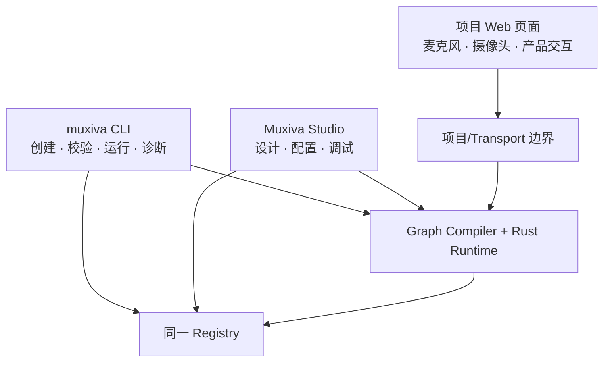

# CLI、Studio 与 Web

CLI、Studio 和项目 Web 页面不是三个 Runtime。它们是同一套 Graph、Registry 和 Rust
Core 面向不同人的入口：CLI 面向工程与自动化，Studio 面向开发者设计与调试，项目
Web 页面面向最终用户体验。



## `muxiva` CLI：可脚本化入口

安装后直接使用 `muxiva` 二进制，不需要每次输入 `cargo run`。

| 命令 | 何时使用 | 是否执行 Graph |
| --- | --- | --- |
| `muxiva init my-agent` | 创建 Graph 与项目 Node 目录 | 否 |
| `muxiva validate my-agent` | 在 CI 或运行前检查身份、配置、Port 与拓扑 | 否 |
| `muxiva run my-agent` | 使用并发 Runtime 执行项目 | 是 |
| `muxiva studio` | 自动发现项目并打开本地可视化环境 | 由用户点击 Run |
| `muxiva doctor --voice` | 检查工具、官方 Node、动态库和语音凭据就绪度 | 否 |
| `muxiva simulate --scenario voice` | 运行无网络工程夹具，检查 Runtime 控制流 | 是，合成数据 |

`simulate` 是测试 Runtime 的工程工具，不是真实 ASR/LLM/TTS 产品 Demo。真实语音体验
从[旗舰语音指南](voice-demo.md)开始。

## Studio：Graph 与 Node 的本地工作台

Studio 随 CLI 发布并默认监听 `127.0.0.1`。它直接读写 Graph v1，主要提供：

- 从 Node Library 拖放 Node，并从输出 Port 拉线到兼容输入 Port；
- 按 Transport、Algorithm、Media、Control、Utility 和 Capability 筛选；
- 选中 Node 查看 Manifest、详细 Port Schema、配置、实现源码与指南；
- 在 Node Lab 创建和编辑项目 Node，再注册到 Library；
- 校验和运行当前画布，查看 Node 回调、Edge 队列、丢帧、事件和结果；
- 在 Connections 中配置 Node 所需的本地凭据，真实值不写入 Graph。

Studio 是本地开发工具，不是应暴露到公网的生产控制面。完整操作见
[Muxiva Studio](studio.md)。

## 独立 Web 应用：最终用户入口

Web 应用与 Studio、Runtime 分开部署。仓库中的 Voice Room 位于
`examples/voice-agent/web/`，负责：

1. 请求浏览器麦克风权限；
2. 使用 Agora Web SDK 加入频道；
3. 发布用户音频并播放 Agent 音频；
4. 展示会话状态、字幕、打断和错误。

网页不执行 Python 模型代码，也不持有 Qwen API Key。媒体和实时交互事件都通过
Transport Node 传输；页面不轮询 NotificationBus，也不控制 Runtime 生命周期。
`muxiva serve` 的最小 Bootstrap API 只返回明确标为 `client_exposed` 的字段；生产部署
应替换为业务后端和短期 Token 服务。详见[Headless Runtime 与独立网页](headless-deployment.md)。

## 三个入口如何协同

典型开发循环是：

```text
muxiva init → 可选 Studio 设计 → muxiva validate → muxiva serve
                                              ├─ Runtime / Nodes（服务器）
                                              └─ 独立 Web（用户设备）
```

提交到 Git 后，CI 使用 `muxiva validate` 和测试重复相同的契约检查；部署系统则可以直接
使用 `muxiva serve` 启动实时 Graph，不需要携带 Studio。
