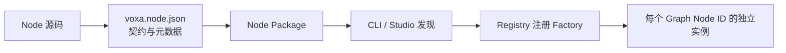

# Node 扩展机制

Node 是 Voxa 的扩展单元。开发者不需要修改 Runtime 才能加入 ASR、工具调用、数据库、
音频处理或自研模型；只需实现统一生命周期，并把实现注册成可发现的 Node Factory。

## 从源码到运行实例



- **实现**包含生命周期与业务逻辑；
- **Node Manifest**声明稳定身份、语言、Port、配置 Schema、类别和入口；
- **Node Package**是可分发目录；
- **Factory**校验配置并创建实例；
- **实例**只属于 Graph 中一个 Node ID，不在多个运行节点间偷偷共享状态。

## Manifest 是 Studio 与 Runtime 的共同契约

`voxa.node/v1` 至少回答这些问题：

| 字段 | 作用 |
| --- | --- |
| `node_type` | 能力的稳定名称 |
| `language` | 选择 Rust、C++、Python 或 TypeScript Host |
| `factory_version` | 精确选择 Factory 契约版本 |
| `kind` | Source、Transform 或 Sink |
| `category` / `capability` | Node Library 的分类与检索 |
| `ports` | 输入输出名称、方向、Frame Type 和详细 Schema |
| `config_schema` | Studio 表单与构建时配置校验 |
| `entrypoint` | Package 内可执行实现的位置 |

Graph 只引用 Manifest 中的身份和声明式配置，不嵌入任意可执行代码或密钥。

## NodeContext 是 Node 与 Runtime 的边界

生命周期回调收到 `ctx`，它提供受控能力：

```python
class TranscriptNode:
    def on_process(self, frame, ctx):
        if not frame.text.strip():
            return                    # 只表示本次没有更多逻辑
        ctx.emit("text_out", frame)    # 数据面，可调用多次
        ctx.publish_event(
            "app.transcript.ready", {"text": frame.text}
        )
```

输出不依赖返回值。一次调用可以发出零个、一个或多个 Frame，也可以只发送 Signal 或
Event。Node 不直接调用下游 Node，不持有 Edge Queue，也不绕过 Runtime 创建全局线程。

## 发现位置

Studio 和 CLI 从受信任的目录发现 Package，包括项目内 `.voxa/nodes/` 和已配置的
Provider Root。Node Library 展示 Manifest、Port Schema、配置项和源码；开发者可以
在 Studio 创建或编辑项目 Node，再导入 Library 并放到画布中。

## 推荐开发流程

1. 先定义输入输出和失败语义；
2. 创建 `voxa.node.json` 和最小实现；
3. 使用 `voxa studio` 导入并检查 Port 与配置表单；
4. 把 Node 连入示例 Graph；
5. 使用 `voxa validate <project>` 检查身份、类型和拓扑；
6. 用测试工具覆盖正常、慢下游、取消和错误路径；
7. 作为项目 Node 或 Provider Node Pack 分发。

选择实现语言：[多语言执行模型](languages.md)。具体教程：[开发 Node](nodes/index.md)。
