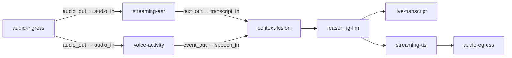
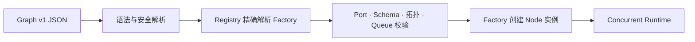

# Graph 与类型化 Port

Graph v1 是一份可审查、可版本控制的运行声明。它说明使用哪些 Node Factory、每个实例
如何配置、哪些 Port 相连以及拥塞时怎么办。Graph 不包含运行线程、远端客户端、密钥
或任意脚本。

## Graph 可以分叉和汇合



一个输出 Port 可以连接多条 Edge，Frame 会进入多个有界队列；汇合 Node 可以通过不同
输入 Port 接收不同 Frame Type。Runtime 保留每条分支的 Lineage 和独立背压指标。

## 文档结构

下面是精简示意，真实文件通常包含更多 Node 和 Edge：

```json
{
  "version": "muxiva.graph/v1",
  "graph_id": "voice-agent",
  "nodes": [
    {
      "id": "asr",
      "node_type": "qwen.asr_realtime",
      "language": "python",
      "factory_version": "1.0.0",
      "node_config": {"model": "qwen3-asr-flash-realtime"}
    },
    {
      "id": "llm",
      "node_type": "qwen.llm_stream",
      "language": "python",
      "factory_version": "1.0.0",
      "node_config": {}
    }
  ],
  "edges": [
    {
      "id": "asr-to-llm",
      "source": {"node": "asr", "port": "text_out"},
      "target": {"node": "llm", "port": "text_in"},
      "frame_type": "text",
      "capacity": 8,
      "overflow": "block"
    }
  ]
}
```

## Factory 身份：精确找到代码

Graph 使用三元组解析 Factory：

```text
node_type + language + factory_version
```

校验器不会猜版本或静默改用另一种语言。`id` 只是本图中的实例名；`node_type` 才是
Package 提供的稳定能力身份。同一 Factory 可以在图中创建多个不同配置的实例。

## Port Type 与 Port Schema

Port 必须声明 `audio`、`video`、`text`、`byte`、`signal` 或 `event` 中的一种 Frame
Type。系统没有无类型的 `any` Port，只有两端类型完全一致才能建立 Edge。

Frame Type 解决“是不是音频”；详细 Port Schema 解决“是哪种音频”，例如：

```text
audio / pcm_s16le / 16000 Hz / mono / 20 ms
```

如果上游输出 48 kHz 而下游要求 16 kHz，Graph 应显式加入 Resample Node，而不是让
Runtime 暗中转换。这使成本、延迟和质量变化都能在图上看见。

## Edge 与 Queue Policy

Edge 同时是路由和有界缓冲区：

| 业务要求 | 建议策略 | 原因 |
| --- | --- | --- |
| 文本不能丢 | `block` | 用背压换完整性 |
| 实时视频只关心最新画面 | `drop_oldest` | 避免播放陈旧内容 |
| 当前批次不能被新数据打扰 | `drop_newest` | 保留已接收数据 |
| 协议一旦拥塞就不可信 | `abort` | 快速失败并明确报警 |

Capacity 不是越大越好：它代表可接受的突发量，也直接影响最坏延迟和内存占用。

## 从 JSON 到运行



`muxiva validate <project>` 执行前半段但不运行 Node；`muxiva run <project>` 只有在编译成功
后才创建实例和外部资源。Studio 使用相同 Compiler，所以画布校验不会形成另一套规则。

## 安全限制

Graph JSON 不能包含可执行源码、动态脚本、真实凭据或任意远程资源；它只能引用受信任
Factory 与声明式配置。可执行实现属于 [Node Package](extensibility.md)，外部服务凭据通过
[Node Connection](provider-architecture.md) 配置。

下一步阅读：[实时流控与控制消息](realtime-control.md)。
