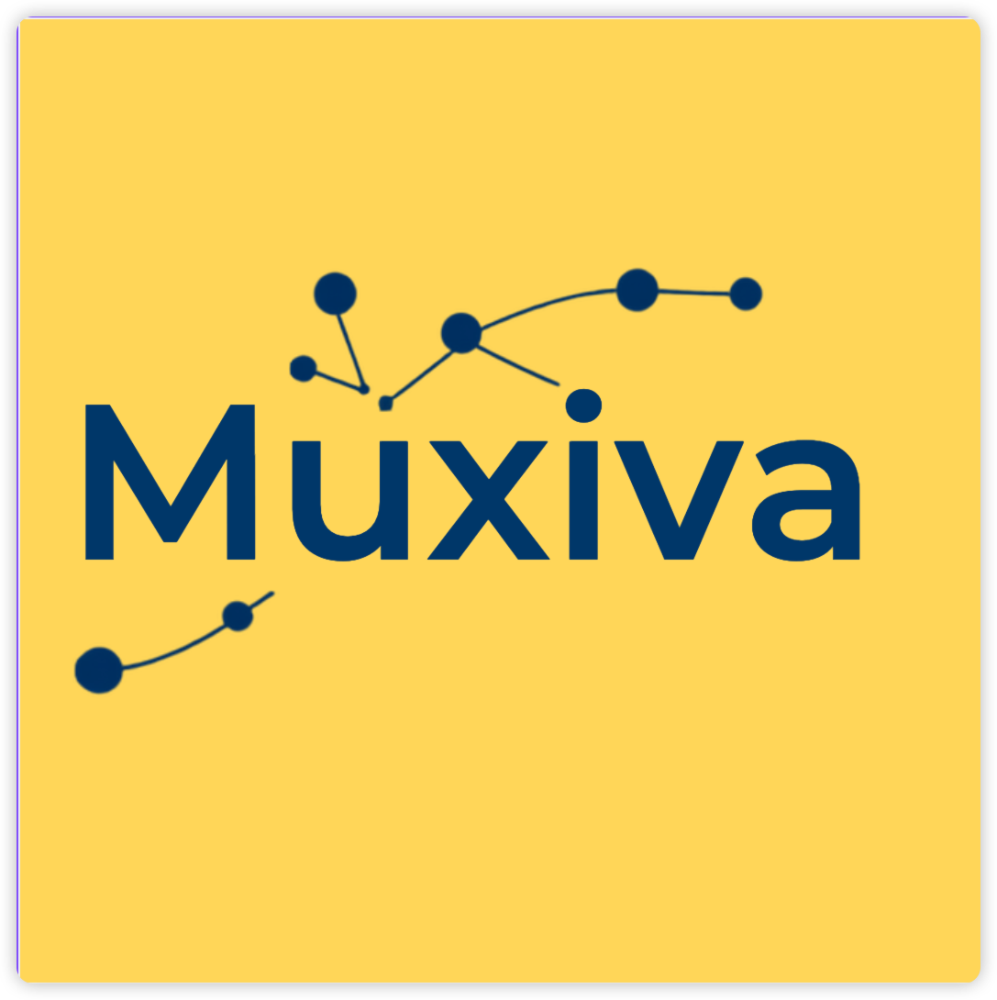
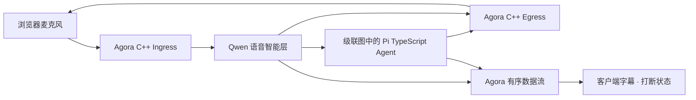

# Muxiva

<p align="center">
  
</p>

**一张实时多模态 Graph，一套统一生命周期，让 Rust、C++、Python 与
TypeScript 共享同一个 Agent Runtime。**

Muxiva 负责调度、有界队列、背压、取消、生命周期、控制消息和可观测性；应用通过
Node 提供语音、推理、媒体、传输与业务能力。

!!! warning "Pre-alpha"
    Runtime 基础已经过测试，但公开 Package 与官方 Node 集成仍在演进。请勿执行
    不受信任的 Node 代码，也不要把 Studio 直接暴露到互联网。

## 体验真实语音 Agent

```bash
./examples/voice-agent/setup.sh
./examples/voice-agent/run.sh
```



这是带真实凭据运行的门面应用：浏览器采集真实麦克风，Agora 传输真实音频，Qwen
完成语音理解与生成。Studio 可选择低延迟 Realtime 图或可检查的
全双工 Qwen Server VAD + ASR → 可使用工具的 Pi TypeScript Agent → 可取消 Qwen TTS
图，并持续展示 Node、Tool Call、Frame 和对话状态。

[运行旗舰语音 Demo](voice-demo.md){ .md-button .md-button--primary }
[打开 Studio 指南](studio.md){ .md-button }

## 选择你的入口

| 目标 | 从这里开始 |
| --- | --- |
| 运行真实语音助手 | [旗舰语音 Demo](voice-demo.md) |
| 安装并运行 Graph | [安装与首次运行](getting-started.md) |
| 可视化开发 | [Muxiva Studio](studio.md) |
| 理解 Runtime | [Runtime 架构](concepts.md) |
| 集成已有 Agent | [Agent 集成 SOP](nodes/agent-integration.md) |
| 开发 Agent 应用或 Node | [开发手册](nodes/index.md) |
| 集成 RTC 或媒体 | [官方与自定义 Node](integrations.md) |
| 参与贡献 | [参与贡献](contributing.md) |

[打开开发手册](nodes/index.md){ .md-button }
