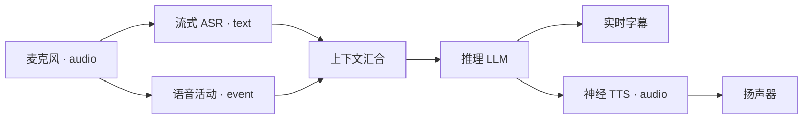

# Voxa

**一张实时多模态 Graph，一套统一生命周期，让 Rust、C++、Python 与
TypeScript 共享同一个 Agent Runtime。**

Voxa 负责调度、有界队列、背压、取消、生命周期、控制消息和可观测性；应用通过
Node 提供语音、推理、媒体、传输与业务能力。

!!! warning "Pre-alpha"
    Runtime 基础已经过测试，但公开 Package 与 Provider 集成仍在演进。请勿执行
    不受信任的 Node 代码，也不要把 Studio 直接暴露到互联网。

## 体验技术架构

```bash
voxa demo
voxa studio examples/graphs/mock-realtime-voice.v1.json
```



Demo 中的 Provider 会明确标记为 Mock；Graph 编译、不可变 Frame、分叉汇合
路由、有界队列、并发调度与生命周期执行都是真实的 Voxa Runtime 行为。

## 选择你的入口

| 目标 | 从这里开始 |
| --- | --- |
| 安装并运行 Graph | [安装与首次运行](getting-started.md) |
| 可视化开发 | [Voxa Studio](studio.md) |
| 理解 Runtime | [Runtime 架构](concepts.md) |
| 编写 Node | [Node Package](nodes/index.md) |
| 集成 RTC 或媒体 | [Provider](integrations.md) |
| 参与贡献 | [参与贡献](contributing.md) |

[打开快速开始](getting-started.md){ .md-button .md-button--primary }
[开发 Node](nodes/index.md){ .md-button }
