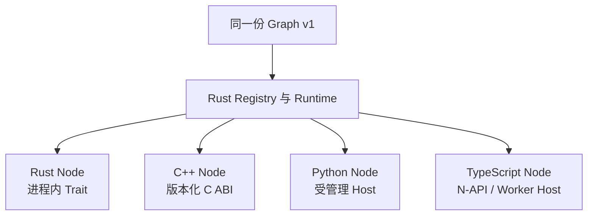

# 多语言执行模型

Voxa 不是四套互不兼容的 SDK。Graph、Frame、Port、生命周期和控制语义由 Rust Core
统一定义，语言适配层只负责把回调与数据安全地跨过语言边界。

## 应该选择哪种语言

| 语言 | 最适合 | 集成边界 | 主要取舍 |
| --- | --- | --- | --- |
| Rust | Runtime 能力、高吞吐媒体处理、Builtin | 进程内 `Node` Trait | 性能与控制最好，学习成本较高 |
| C++ | RTC、Codec、已有原生 SDK | 版本化 C ABI / Node Pack | 易接厂商原生 SDK，需严格管理内存和线程 |
| Python | 模型 API、算法编排、快速迭代 | 受管理 Python Host | 生态丰富，跨域开销高于进程内 Rust |
| TypeScript | Web 生态、业务集成、JS 团队 | N-API / Worker Host | 开发友好，需尊重异步和 Worker 生命周期 |

语言不会改变 Port 契约。例如 Python ASR 输出的 `text` Frame 可以直接进入 Rust
Transform 或 C++ Sink；Runtime 仍然执行相同的队列、背压、Turn 和关闭规则。

## 边界上的四条规则

1. **Frame 契约不变。** Host 必须保留 ID、时间、序号、媒体描述和 Lineage。
2. **输出必须显式。** 所有语言都通过 Context 发出 Frame、Signal 和 Event。
3. **生命周期必须配对。** Prepare 成功后必须 Finish 或 Abort，外部线程也要有界退出。
4. **失败必须结构化。** 异常、ABI 错误和进程退出都转换为 Runtime 可处理的错误，
   不能静默丢失。

## 多语言不是把代码塞进 Graph

Graph 只保存 `node_type + language + factory_version` 和配置。源码、共享库、Python 包
或 JavaScript 包位于受信任的 Node Package 中，由 Factory/Host 加载。这把可审查的
拓扑声明和可执行供应链清楚分开。

## 当前 Provider 的分层示例

- Agora Transport Node 使用 C++，贴近官方 Native SDK、音频回调和 RTC 生命周期；
- Qwen Algorithm Node 使用 Python，贴近模型 API、流式事件与算法迭代；
- Rust Core 只看标准 Frame 和生命周期，不导入任何 Agora 或 Qwen 业务代码。

从对应教程开始：[Rust](nodes/rust.md) · [C++](nodes/cpp.md) ·
[Python](nodes/python.md) · [TypeScript](nodes/typescript.md)。
