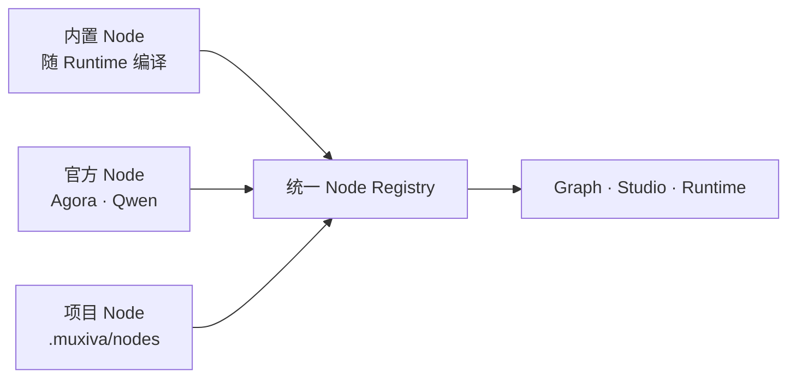

# Node 架构

Muxiva Runtime 只运行 Node，不存在另一种叫 Provider 的运行实体。Agora、Qwen、FFmpeg
只是官方维护的 Node 命名空间；它们与项目自定义 Node 使用相同的 Manifest、Port、Frame、
生命周期和 Registry。

| 来源 | 例子 | 特点 |
| --- | --- | --- |
| 内置 Node | `builtin.audio_resampler` | 通用、无厂商依赖 |
| 官方 Node | `agora.audio_source`、`qwen.audio_realtime` | 官方示例和外部 SDK/API 适配 |
| 项目 Node | `my_agent.rag` | 位于 Agent 的 `.muxiva/nodes/`，由开发者维护 |

外部连接配置由 Node Manifest 的 `connection_id` 声明，并保存在项目 `.env`。Connection
只是凭据配置，不产生新的运行时抽象。

开发者可以复制官方 Node 的结构，在 `.muxiva/nodes/<package>/` 中编写 Rust、Python、
TypeScript 或 C++ Node；Studio 会自动发现并与所有其他 Node 一起展示。
