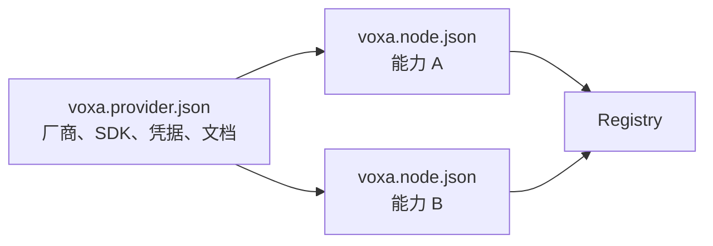

# Provider 分层架构

Provider 是外部厂商能力与 Voxa Node 契约之间的适配层。它属于业务扩展，不属于
Rust Core。Core 不应该出现 Qwen API 参数、Agora Token 或某个厂商的错误码。

## 两级 Manifest



- `voxa.provider/v1` 描述整个 Provider：ID、类别、厂商、SDK、License、连接字段和
  官方文档；
- `voxa.node/v1` 描述一个具体 Node：能力、语言、入口、配置、Port 和 Schema。

把两者拆开后，一个 Provider 可以提供多个 Node，而 API Key、Endpoint 等共同连接
信息只定义一次。

## Provider 分类

| 类别 | 负责什么 | 例子 |
| --- | --- | --- |
| Transport | 把外部实时流变成 Frame，或反向发送 | Agora RTC、WebSocket |
| Algorithm | 理解或生成内容 | VAD、ASR、LLM、TTS、Realtime Model |
| Media | 改变媒体表示，不理解语义 | Resample、AEC、Codec、Mixer |
| Control | 身份、会话、策略或工具控制 | Auth、Turn Policy、Tool Router |
| Utility | 存储、日志和通用集成 | Object Storage、Database、Telemetry |

分类描述职责，`kind` 描述 Graph 角色，两者不是同一概念。例如 ASR 的类别是
Algorithm，Graph Kind 通常是 Transform。

## 物理目录也是架构边界

```text
providers/
├── transport/
│   └── agora/
│       ├── voxa.provider.json
│       └── cpp/nodes/...
└── algorithm/
    └── qwen/
        ├── voxa.provider.json
        └── python/nodes/...
```

Agora C++ 代码和 Qwen Python 代码分别留在 Provider 根目录；Rust Core 不依赖它们。
Studio 扫描 Provider Root 后，把 Node 按类别、厂商和能力展示在 Library 中。

## 凭据边界

Manifest 只声明凭据字段，不保存真实值。开发者在 Studio Connections 或环境变量中
配置；服务端只把显式标记为 `client_exposed` 的非敏感字段交给网页。模型 API Key
永远不应进入 Graph JSON、Git 仓库或浏览器。

## 增加一个 Provider

1. 选择 Transport、Algorithm、Media、Control 或 Utility 类别；
2. 创建 Provider Manifest，写清 SDK、License、下载地址和连接字段；
3. 为每个能力创建独立 Node Package 和 Port Schema；
4. 用合适语言实现，并通过 Context 输出；
5. 覆盖配置缺失、网络失败、取消、重连和关闭测试；
6. 编写从申请凭据到运行示例的完整指南；
7. 在 Studio Node Library 验证发现、过滤、源码和 Schema 展示。

查看现有实现与配置：[Provider 目录](providers/index.md)。
