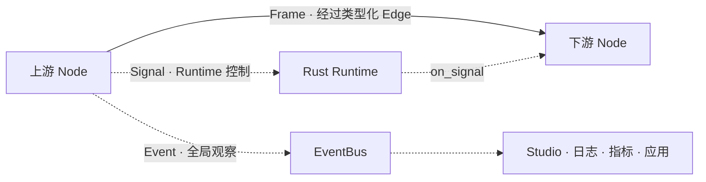

# 实时流控与控制消息

实时 Agent 不只是把 A 的输出交给 B。它还必须回答：下游变慢怎么办、用户插话时
如何停止旧回答、哪些消息需要进入数据链路、哪些信息只供界面和监控观察。

Voxa 把通信分成数据面和控制面：

## Frame：参与业务处理的数据

音频、视频、文本和字节 Frame 沿 Graph Edge 流动。它们受 Port 类型、队列容量、
Overflow Policy 和拓扑约束。下游 Node 收到 Frame 后，才执行 `on_process`。

## Signal：改变运行状态的控制消息

Signal 用于打断、取消、Turn 切换或其他 Runtime 控制。Node 通过
`ctx.emit_signal(...)` 发出，由 Runtime 决定传播与处理，不需要把控制信息伪装成
普通文本或音频。

典型场景是 Barge-in：用户在 Agent 播放回答时重新说话，VAD Node 发出打断 Signal，
Runtime 结束旧 Turn，取消旧生成，并阻止旧音频继续进入扬声器。

## EventBus：让旁观者知道发生了什么

Event 是全局可观察通知，例如转写完成、首 Token 到达、Provider 重连或延迟超限。
Node 用 `ctx.publish_event(...)` 发布；Studio、日志、指标系统或应用订阅者可以观察，
但 Event 不替代 Graph 的业务数据流。

| 需求 | 应使用 |
| --- | --- |
| 把音频交给 ASR | Frame + Edge |
| 通知 Runtime 停止旧回答 | Signal |
| 在 Studio 展示转写或延迟 | EventBus Event |
| 把 LLM 文本交给 TTS | Frame + Edge |

## 有界队列与背压

每条 Edge 的队列都有固定 Capacity。满载时采用显式策略：

| 策略 | 行为 | 适合场景 |
| --- | --- | --- |
| `block` | 等待下游腾出空间 | 必须完整处理的文本或命令 |
| `drop_oldest` | 丢弃最旧 Frame，保留实时性 | 实时音视频预览 |
| `drop_newest` | 保留已排队数据 | 不希望新数据打乱批次 |
| `abort` | 立即失败并进入关闭流程 | 丢帧不可接受的协议 |

无限队列看似“不丢数据”，实际上会把短暂拥塞变成长延迟和内存失控。Voxa 强制开发者
明确选择容量和策略，使延迟、完整性和故障行为可预测。

## Turn 与打断

Turn 表示一次可被整体管理的交互。Frame 的标识、时间和 Lineage 让 Runtime 能判断
结果属于哪个 Turn。发生打断后，系统需要同时做到：

1. 标记旧 Turn 已取消；
2. 向支持取消的 Provider/Node 发送控制；
3. 清理或忽略队列中的旧 Frame；
4. 拒绝晚到的旧模型结果；
5. 让新 Turn 立即获得调度机会。

这比在 TTS Node 里写一个布尔变量更可靠，因为打断同时影响模型、队列、播放和观测。

## 生命周期与关闭

正常运行按照 `prepare → process → finish`；错误、超时或取消进入 `abort`。Runtime 对
Worker 和外部执行域采用有界等待，避免进程已经报告退出但后台线程仍然占用麦克风、
网络连接或模型流。

下一步阅读：[Node 如何扩展](extensibility.md)和[端到端语音链路](voice-architecture.md)。
