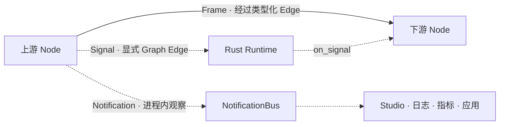

# 实时流控与控制消息

实时 Agent 不只是把 A 的输出交给 B。它还必须回答：下游变慢怎么办、用户插话时
如何停止旧回答、哪些消息需要进入数据链路、哪些信息只供界面和监控观察。

Muxiva 把通信分成数据面和控制面：

## Frame：参与业务处理的数据

音频、视频、文本和字节 Frame 沿 Graph Edge 流动。它们受 Port 类型、队列容量、
Overflow Policy 和拓扑约束。下游 Node 收到 Frame 后，才执行 `on_process`。

## Signal：改变运行状态的控制消息

Signal 用于打断、取消、刷新缓存或其他跨 Node 控制。Node 通过
`ctx.emit_signal(...)` 发出，Runtime 只沿当前 Node 的显式出 Edge 投递，并调用目标 Node
的 `on_signal`；Core 不解释 Signal 名称，也不执行语音业务规则。Signal 不是进程级广播。

典型场景是 Barge-in：VAD 只发 `speech.started/stopped` 观察 Event，ASR 最终文本进入
`builtin.voice_turn_controller`。控制器过滤口水词并批准新轮次后，唯一发出
`muxiva.turn.cancelled`；Agent/TTS 丢弃旧 generation，Audio Sink 清空旧播放。Runtime
只负责沿显式 Edge 投递。

## NotificationBus：让旁观者知道发生了什么

Notification 是进程内观察通知，例如转写完成、首 Token 到达、Node 重连或延迟超限。
Node 用 `ctx.publish_notification(...)` 发布；Studio、日志、指标系统或应用订阅者可以观察，
但 NotificationBus 通知不替代沿 Graph 传播的 `EventFrame` 或其他业务数据。

| 需求 | 应使用 |
| --- | --- |
| 把音频交给 ASR | Frame + Edge |
| 通知相关 Node 停止旧回答 | Signal |
| 在 Studio 展示本地运维信息 | NotificationBus 通知 |
| 把转写或说话状态送到远程客户端 | Frame + Transport Node |
| 把 LLM 文本交给 TTS | Frame + Edge |

## 有界队列与背压

每条 Edge 的队列都有固定 Capacity。满载时采用显式策略：

| 策略 | 行为 | 适合场景 |
| --- | --- | --- |
| `block` | 等待下游腾出空间 | 必须完整处理的文本或命令 |
| `drop_oldest` | 丢弃最旧 Frame，保留实时性 | 实时音视频预览 |
| `drop_newest` | 保留已排队数据 | 不希望新数据打乱批次 |
| `abort` | 立即失败并进入关闭流程 | 丢帧不可接受的协议 |

无限队列看似“不丢数据”，实际上会把短暂拥塞变成长延迟和内存失控。Muxiva 强制开发者
明确选择容量和策略，使延迟、完整性和故障行为可预测。

## 业务会话与打断

语音 Turn 由框架内置但显式可配置的 `builtin.voice_turn_controller` 管理，而不是由
Runtime 调度器硬编码，也不应散落在各 Provider。发生打断时，相关 Node 需要做到：

1. 模型 Node 取消当前远端请求；
2. 模型 Node 丢弃该请求晚到的片段；
3. 播放 Node 清理尚未播放的音频；
4. NotificationBus 发布本地运维状态，Transport Node 向客户端发送交互状态；
5. 后续输入继续沿 Graph 流动。

策略留在 Node，机制留在 Core：既能协调模型、播放和观测，也不会让通用 Runtime
依赖某一家模型或某一种语音交互协议。

## 生命周期与关闭

正常运行按照 `prepare → process → finish`；错误、超时或取消进入 `abort`。Runtime 对
Worker 和外部执行域采用有界等待，避免进程已经报告退出但后台线程仍然占用麦克风、
网络连接或模型流。

下一步阅读：[Node 如何扩展](extensibility.md)和[端到端语音链路](voice-architecture.md)。
