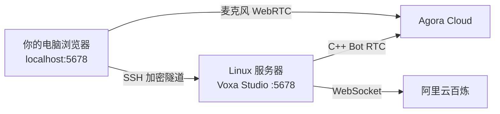

# 无 GUI Linux 与远程 Studio

Studio 是由 `voxa` 启动的本地 HTTP 服务，网页不要求与 Runtime 运行在同一台机器。
在无桌面的 Linux 服务器上，推荐让 Studio 只监听服务器的 `127.0.0.1`，再通过 SSH
端口转发，用你自己电脑上的 Chrome、Edge 或 Safari 打开。



这种方式下，网页和麦克风在你的电脑上；Graph、Python/C++ Provider、日志和 `.env`
仍在 Linux 服务器上。

## 推荐方案：SSH 端口转发

### 1. 在 Linux 服务器启动固定端口

普通项目：

```bash
cd /srv/my-agent
voxa studio . --host 127.0.0.1 --port 5678 --no-open
```

仓库内的旗舰语音 Demo：

```bash
cd /srv/Voxa
./examples/voice-agent/run.sh --host 127.0.0.1 --port 5678 --no-open
```

无 `DISPLAY`/`WAYLAND_DISPLAY` 时，`run.sh` 会自动禁用打开浏览器。它会打印类似：

```text
[VOXA][INFO][studio.ready] url=http://127.0.0.1:5678/#<ACCESS_TOKEN>
```

保持这个进程运行。不要把包含 `#<ACCESS_TOKEN>` 的完整 URL 发给别人。

### 2. 在你自己的电脑建立隧道

另开一个本地终端：

```bash
ssh -N -L 5678:127.0.0.1:5678 user@your-linux-server
```

如果 SSH 使用自定义端口或私钥：

```bash
ssh -p 2222 -i ~/.ssh/your_key -N \
  -L 5678:127.0.0.1:5678 user@your-linux-server
```

### 3. 在本地浏览器打开完整 URL

复制服务器输出的完整 URL（包括 `#` 后面的访问 Token）到你电脑的浏览器：

```text
http://127.0.0.1:5678/#<ACCESS_TOKEN>
```

进入 Voice Room 后，麦克风权限授予的是你**本地浏览器**。浏览器直接加入 Agora；
Linux 服务器上的 C++ Bot 使用另一个 UID 加入同一 Channel。

## SSH 断开后继续运行

使用 `tmux` 或 `systemd` 保持 Studio 进程。最简单的 `tmux` 流程：

```bash
tmux new -s voxa
./examples/voice-agent/run.sh --host 127.0.0.1 --port 5678 --no-open
```

按 `Ctrl-b`，再按 `d` 退出会话；重新连接后：

```bash
tmux attach -t voxa
```

日志始终位于：

```bash
tail -f examples/voice-agent/.voxa/runtime.log
```

## 容器中运行

容器内要监听 `0.0.0.0`，但宿主机端口只绑定到回环地址：

```bash
docker run --rm \
  -p 127.0.0.1:5678:5678 \
  your-voxa-image \
  voxa studio /app --host 0.0.0.0 --port 5678 --no-open
```

如果 Docker 宿主机就是你的电脑，打开输出 URL 时把主机改为
`http://127.0.0.1:5678/` 并保留原来的 `#<ACCESS_TOKEN>`。如果 Docker 在远程服务器，
仍使用上一节 SSH 隧道。

## 不推荐：直接开放公网端口

下面的命令会让局域网或公网接口直接监听 Studio：

```bash
voxa studio . --host 0.0.0.0 --port 5678 --no-open
```

Studio 可以读写 Graph、保存 Connections 并启动 Runtime；不要把它裸露在公网。并且普通
公网 HTTP 通常不能获得浏览器麦克风权限。必须远程共享时，应放在 HTTPS 反向代理、身份
认证、网络 ACL/VPN 和防火墙之后。个人开发优先使用 SSH 隧道。

## Linux 语音 Demo 的额外要求

- Qwen Python Provider 不需要 GUI，也不需要 Qwen SDK；服务器必须能访问百炼 WebSocket。
- 浏览器麦克风由你的本地电脑提供，因此 Linux 服务器不需要声卡。
- Agora C++ Bot 需要与你的 Linux 架构匹配的 Agora Native SDK。macOS 的自动下载包不能
  在 Linux 使用；将 Linux SDK 解压目录传给 `setup.sh`：

```bash
./examples/voice-agent/setup.sh /opt/agora-linux-sdk
```

- 服务器与本地浏览器都必须能访问 Agora 网络；企业防火墙环境需按 Agora 官方网络要求
  放行域名和端口。

## 常见问题

| 现象 | 处理 |
| --- | --- |
| 服务器提示 `xdg-open` 失败 | 加 `--no-open`；新版本 `run.sh` 在无桌面 Linux 会自动添加 |
| 本地浏览器连接被拒绝 | 确认 Studio 仍运行、两端都使用 `5678`、SSH 隧道没有退出 |
| 页面提示访问 Token 无效 | 必须复制本次启动输出的完整 URL，包括 `#` 后内容 |
| Studio 能开但麦克风不可用 | 使用本地 `127.0.0.1` 隧道 URL，不要使用远程裸 HTTP 地址 |
| 浏览器加入但 Bot 不加入 | 检查 Linux Agora SDK、Bot Token、服务器网络和 Runtime 日志 |

下一步：[申请语音凭据](voice-credentials.md) · [运行旗舰语音 Demo](voice-demo.md)。
