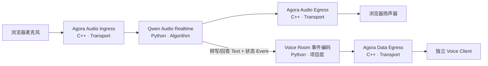
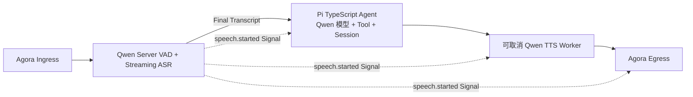
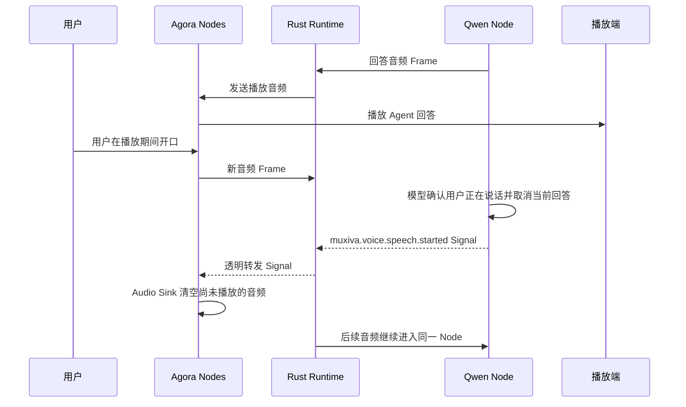

# 端到端语音链路

一条真实语音链路最能说明 Muxiva 的分层价值：浏览器处理用户体验，Agora 处理网络传输，
Qwen 处理算法，Rust Core 处理实时调度。任何一层都不需要知道其他层的内部实现。

## 两张可选 Graph

### Realtime 模型图

Realtime 模型把语音理解与生成放在一个流式模型会话中，链路短、交互自然：

适合优先追求低延迟、自然轮次和较少组件的应用。

### 级联图

级联图把能力拆开，便于分别选择模型、观察中间结果和插入业务逻辑：

Demo 2 使用 Qwen ASR 完成 Server VAD 与流式转写，项目内 Pi TypeScript Agent 通过
Qwen 模型管理会话与 Tool Call，再由 Qwen TTS 合成。Agent 和 TTS 通过 Node Context
请求 Runtime 内部唤醒，在短回调中排空有界结果队列；调度机制不会显示成业务 Node 或
`tick_in` Port。最终 ASR Text 已经代表一个提交完成的用户问题，因此直接进入 Agent。
各阶段仍可替换。

## 每一层到底做什么

| 层 | 实现 | 职责 | 不负责 |
| --- | --- | --- | --- |
| 项目 Web | HTML/JS + Agora Web SDK | 麦克风权限、频道、播放、交互 UI | 模型密钥与 Runtime 调度 |
| 项目 Node | Python + TypeScript | Voice Room 协议、Pi Agent 会话与工具 | Runtime 原语或 Agora 单包限制 |
| Agora 官方 Node | C++ Node Pack | 单一共享 RTC Session、音频收发、可靠有序客户端消息 | ASR、LLM、Graph 调度 |
| Runtime Core | Rust | 类型、队列、并发、透明 Signal 路由、关闭 | 厂商请求、语音 Turn 或产品 UI |
| Qwen 官方 Node | Python Node Pack | Realtime、ASR、可选 LLM 与 TTS 流 | Agent 策略、RTC 频道与 Edge Queue |
| 开发工具 | CLI + Studio | 创建、配置、校验、运行、观测 | 生产用户界面 |

## 全双工与 Barge-in

全双工不是“同时开两个 Socket”就完成。用户插话时需要跨层协作：

打断语义完全属于 Node。Realtime 图由 Qwen Audio Node 取消远端回答；级联图由 Qwen
ASR Server VAD 发出同名 Signal，Pi Driver 调用 `agent.abort()`、Qwen TTS 关闭当前 WebSocket
并清空待合成文本与 PCM；TTS 自己记录取消序号并拒绝迟到的旧回答，Agora Audio Sink
清空播放队列并拒绝迟到音频。Core 不理解语音、Turn 或具体 Signal 名称，只负责路由
不透明 Signal。

## 客户端数据不是 Studio 遥测

ASR、Agent 文字和说话状态先进入项目内的 `voice_room.event_encoder`，再从 Graph 进入
`agora.data_sink`。应用 Node 负责 `muxiva.client-event/v1`，Agora Node 负责分片和可靠有序
传输。浏览器从 Agora 数据流接收消息，不再轮询 `/api/v1/runtime/events`，也不能启停 Runtime。
NotificationBus 继续作为进程内日志、指标和 Studio 运维观测设施，但不是终端用户协议。

本地 `/api/v1/client/session` 只负责给浏览器提供临时 RTC 启动配置。生产部署应替换为
自己的鉴权与短期 Token 服务，媒体和消息链路无需改变。

第一版会话隔离采用严格模型：一个 Agora Channel 对应一个 Agent Session 和一个配置好的
浏览器 UID。共享 C++ Session 会丢弃其他 UID 的媒体与消息，避免错误混合多名参与者。

!!! note "级联取消边界"
    Demo 2 已能主动中止 Pi 模型流并关闭 TTS WebSocket，再由 Agent generation、TTS
    取消序号和 Agora 播放水位过滤晚到结果。已经发进 Agora 网络或浏览器播放缓冲区的
    PCM 无法撤回，因此 Audio Sink
    仍使用短包和有界队列；“硬打断”指取消服务端连接与本地流水线，不代表逆转已发送媒体。

## 凭据与部署边界

- Agora 临时 RTC Token 可以按最小权限提供给浏览器；生产环境由 Token Server 签发；
- Qwen API Key 和 Workspace ID 只存在于服务端 Connections/环境变量；
- Graph 与 Node Manifest 可以提交 Git，但不包含真实密钥；
- Studio 只用于本地开发，生产网页通过明确的应用服务边界连接 Runtime。

要亲自跑通两张图，请按照[从零运行真实语音 Agent](voice-demo.md)逐步操作。
