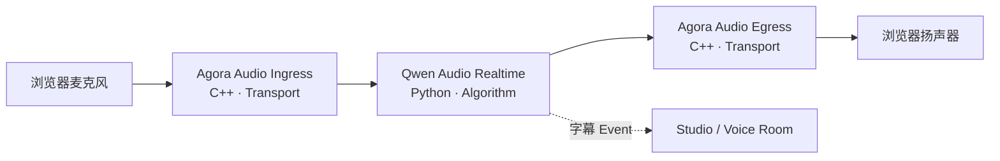
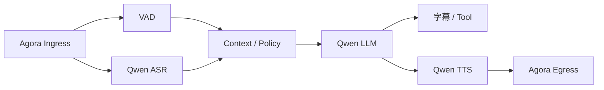
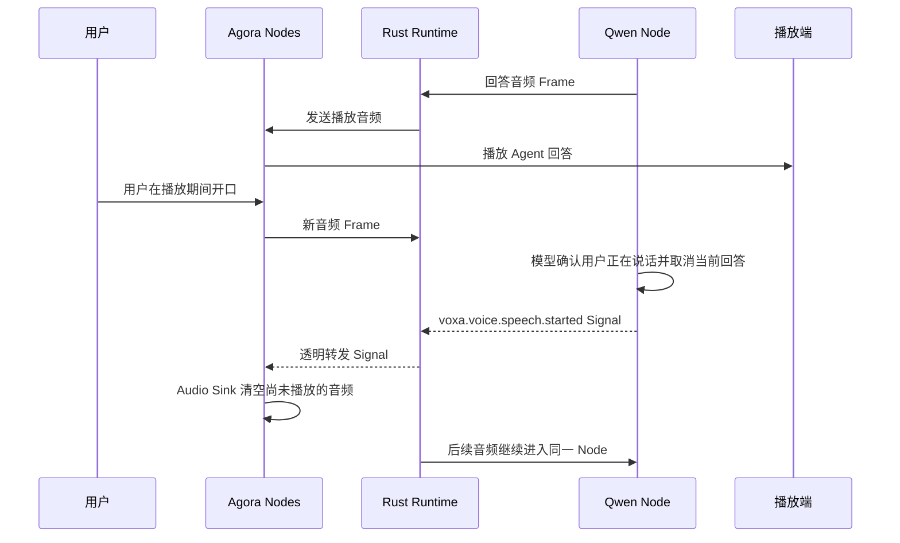

# 端到端语音链路

一条真实语音链路最能说明 Voxa 的分层价值：浏览器处理用户体验，Agora 处理网络传输，
Qwen 处理算法，Rust Core 处理实时调度。任何一层都不需要知道其他层的内部实现。

## 两张可选 Graph

### Realtime 模型图

Realtime 模型把语音理解与生成放在一个流式模型会话中，链路短、交互自然：

适合优先追求低延迟、自然轮次和较少组件的应用。

### 级联图

级联图把能力拆开，便于分别选择模型、观察中间结果和插入业务逻辑：

适合需要自定义 VAD、提示词、工具、审核、字幕或 TTS 的应用。分支与汇合是 Graph 的
正常能力，不是只能运行 `A → B → C` 的线性 Pipeline。

## 每一层到底做什么

| 层 | 实现 | 职责 | 不负责 |
| --- | --- | --- | --- |
| 项目 Web | HTML/JS + Agora Web SDK | 麦克风权限、频道、播放、交互 UI | 模型密钥与 Runtime 调度 |
| Agora 官方 Node | C++ Node Pack | RTC 收发与 PCM Frame 转换 | ASR、LLM、Graph 调度 |
| Runtime Core | Rust | 类型、队列、并发、透明 Signal 路由、关闭 | 厂商请求、语音 Turn 或产品 UI |
| Qwen 官方 Node | Python Node Pack | Realtime 或 ASR/LLM/TTS 流 | RTC 频道与 Edge Queue |
| 开发工具 | CLI + Studio | 创建、配置、校验、运行、观测 | 生产用户界面 |

## 全双工与 Barge-in

全双工不是“同时开两个 Socket”就完成。用户插话时需要跨层协作：

打断语义完全属于 Node：Qwen Node 负责取消远端回答并丢弃晚到片段，Agora Audio Sink
负责停止旧音频。Core 不理解语音、Turn 或具体 Signal 名称，只负责把这个不透明 Signal
可靠地广播给 Node。因此自定义 Node 可以复用 EventBus，而不会把业务规则写进框架核心。

## 凭据与部署边界

- Agora 临时 RTC Token 可以按最小权限提供给浏览器；生产环境由 Token Server 签发；
- Qwen API Key 和 Workspace ID 只存在于服务端 Connections/环境变量；
- Graph 与 Node Manifest 可以提交 Git，但不包含真实密钥；
- Studio 只用于本地开发，生产网页通过明确的应用服务边界连接 Runtime。

要亲自跑通两张图，请按照[从零运行真实语音 Agent](voice-demo.md)逐步操作。
